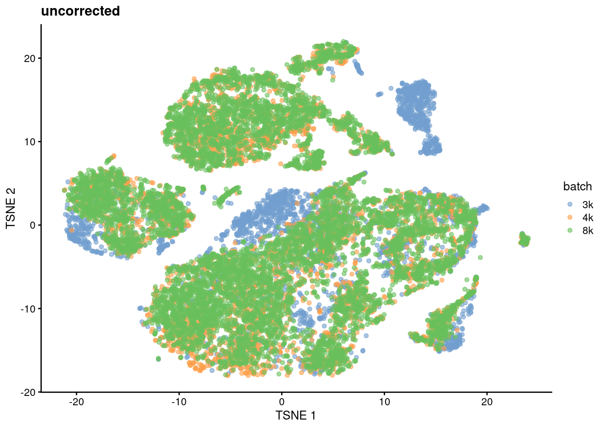
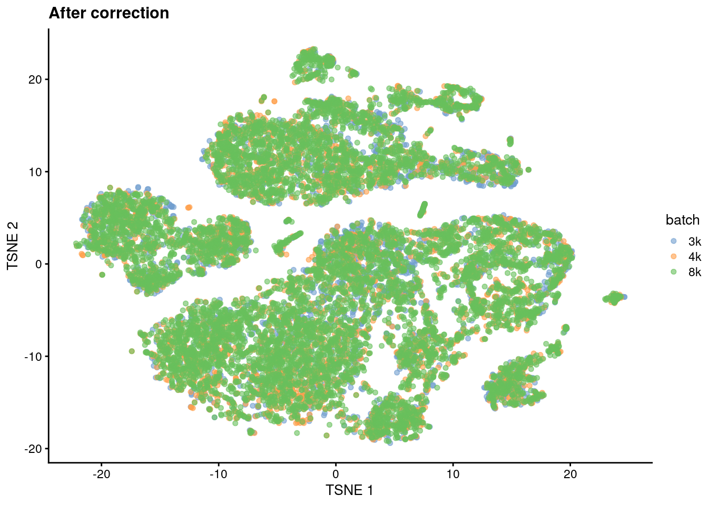
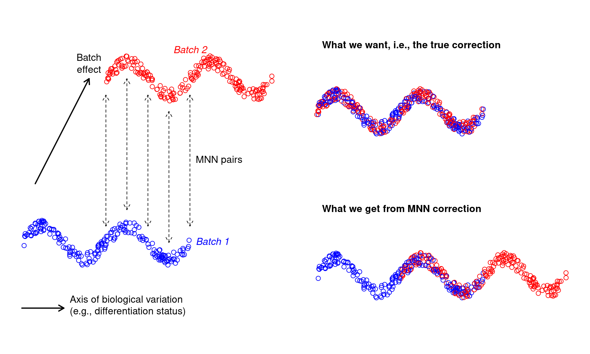
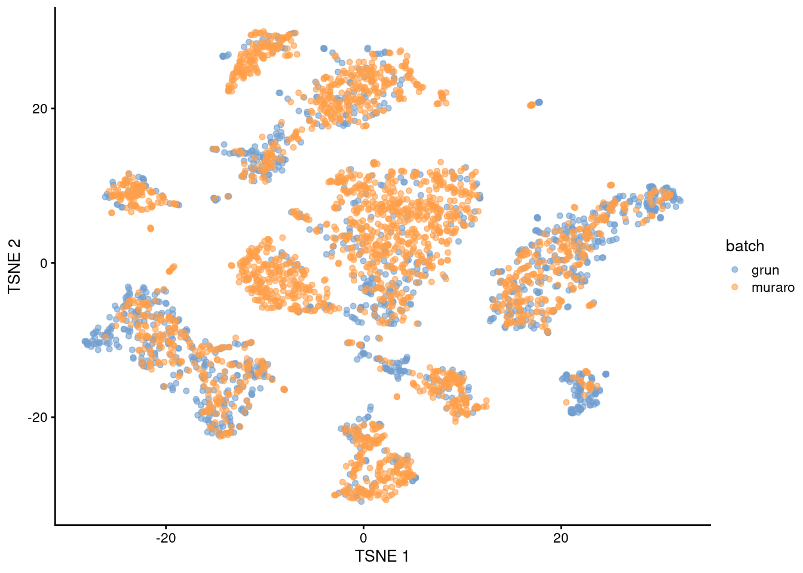
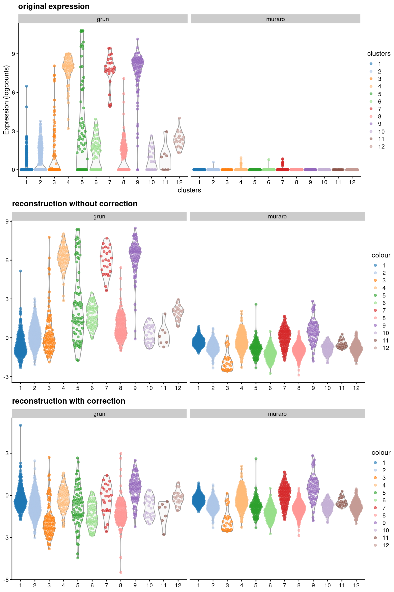
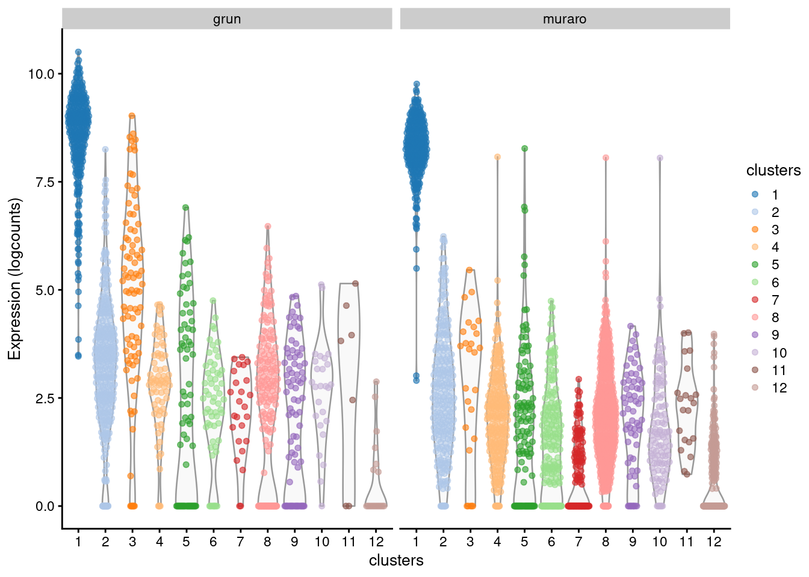

---
output:
  html_document
bibliography: ref.bib
---

# Batch correction 


## Motivation

In large scRNA-seq projects, data generation is split across multiple batches due to logistical constraints.
However, the processing of different batches is often subject to uncontrollable differences,
e.g., small changes in incubation times, differences in reagent concentration/quality.
This may introduce systematic differences in the observed expression in cells from different batches, a.k.a., batch effects.
Batch effects are problematic as they can be major drivers of heterogeneity in the data,
masking relevant biological differences and complicating interpretation of the results.

Batch correction aims to remove batch effects to simplify downstream procedures like clustering.
The aim is to merge cells from different batches that represent the same biological subpopulation,
ensuring that they are assigned to the same cluster for easier interpretation.
Otherwise, cells may cluster by their batch of origin, which would be quite uninteresting.
Note that this step is quite different from the blocking discussed in most of the previous chapters,
as setting `block=` just instructs those functions to ignore the batch effect instead of actively removing it.

Historically, we used linear regression for batch correction of RNA-seq data [@ritchie2015limma;@leek2012sva].
(We can achieve the same effect with our PCA if we compute the components from the residuals, see Section \@ref(pca-block).)
However, this assumes that the composition of cell subpopulations is either known, and can be used as a covariate in the model;
or the composition is the same across batches, with a consistent batch effect in each subpopulation.
Such assumptions are usually inappropriate for single-cell studies.
Instead, we use bespoke methods for single-cell data [@haghverdi2018batch;@butler2018integrating;@lin2019scmerge] that do not require these strong assumptions^[
Well, to be more precise, they trade these obviously-wrong assumptions for a different set of less-obviously-wrong assumptions.].

## Using mutual nearest neighbors 

Mutual nearest neighbors (MNN) correction was one of the first batch correction methods dedicated to scRNA-seq data [@haghverdi2018batch]. 
For each cell in batch $B_1$, we search for the $k$ nearest neighbors in batch $B_2$ (for some small $k$, e.g., 10 - 20).
Similarly, for each cell in batch $B_2$, we search for the $k$ nearest neighbors in batch $B_1$.
We form an MNN pair between cells $x_1$ in batch $B_1$ and $x_2$ in batch $B_2$ if $x_1$ is $x_2$'s nearest neighbor and vice versa.
The assumption is that MNN pairs will (mostly) only form between $x_1$ and $x_2$ from the same biological subpopulation.
A subpopulation unique to batch $B_2$ will (hopefully) not be able to form MNN pairs to $B_1$,
as each cell in $B_1$ will be preoccupied with forming MNN pairs with cells from its matching subpopulation in $B_2$.
The difference between the cells in each MNN pair defines the direction and magnitude of the batch effect for its surrounding neighborhood,
allowing us to correct, e.g., $B_2$ to $B_1$ by subtracting that difference from each cell in $B_2$.
To demonstrate, let's use several PBMC datasets from 10X Genomics [@zheng2017massively]:


``` r
library(TENxPBMCData)
sce.pbmc3k <- TENxPBMCData('pbmc3k')
sce.pbmc4k <- TENxPBMCData('pbmc4k')
sce.pbmc8k <- TENxPBMCData('pbmc8k')

# Finding a common set of genes across all batches to allow us to combine
# everything into a single object. This is only necessary if the different
# batches were processed with different genome annotations.
inter.pbmc <- Reduce(
    intersect,
    list(
        rownames(sce.pbmc3k),
        rownames(sce.pbmc4k),
        rownames(sce.pbmc8k)
    )
)
sce.pbmc <- combineCols(
    sce.pbmc3k[inter.pbmc,],
    sce.pbmc4k[inter.pbmc,],
    sce.pbmc8k[inter.pbmc,]
)
sce.pbmc$batch <- rep(
    c("3k", "4k", "8k"),
    c(ncol(sce.pbmc3k), ncol(sce.pbmc4k), ncol(sce.pbmc8k))
)

# For each dataset, TENxPBMCData loads the count data into the R session as a
# file-backed matrix, i.e., the "matrix" object is just a pointer to file
# containing the actual counts. For greater efficiency, we load the data into
# memory as a sparse matrix so that we don't have to repeatedly read from disk.
counts(sce.pbmc) <- as(counts(sce.pbmc), "dgCMatrix")

# Quality control, blocking on the batch of origin for each cell.
is.mito.pbmc <- grep("MT", rowData(sce.pbmc)$Symbol)
library(scrapper)
sce.qc.pbmc <- quickRnaQc.se(
    sce.pbmc,
    subsets=list(MT=is.mito.pbmc),
    block=sce.pbmc$batch
)
sce.qc.pbmc <- sce.pbmc[,sce.qc.pbmc$keep]

# Normalization, blocking on the batch of origin for each cell.
sce.norm.pbmc <- normalizeRnaCounts.se(
    sce.qc.pbmc,
    size.factors=sce.qc.pbmc$sum,
    block=sce.qc.pbmc$batch
)

# We now choose the top HVGs, with blocking.
sce.var.pbmc <- chooseRnaHvgs.se(
    sce.norm.pbmc, 
    block=sce.norm.pbmc$batch
)

# Running the PCA on the HVG submatrix, with blocking.
sce.pca.pbmc <- runPca.se(
    sce.var.pbmc,
    features=rowData(sce.var.pbmc)$hvg,
    number=25,
    block=sce.var.pbmc$batch
)
```

If we examine the distribution of cells without any batch correction, we observe some batch-specific substructure (Figure \@ref(fig:batch-pbmc-uncorrected)).
Such batch effects could have any number of causes -
biological differences in the underlying cell population between donors,
differences in the technology used for cell capture and/or sequencing,
or changes in the computational piplines for alignment and quantification.
Regardless of their origins, we consider these differences to be uninteresting as all batches are assaying the same PBMC population and should be replicates of each other. 


``` r
sce.unc.tsne.pbmc <- runTsne.se(sce.pca.pbmc)
library(scater)
plotReducedDim(sce.unc.tsne.pbmc, "TSNE", colour_by="batch") + ggtitle("uncorrected")
```

<div class="figure">

<p class="caption">(\#fig:batch-pbmc-uncorrected)$t$-SNE plot of the cells from the PBMC dataset, without any batch correction. Each cell is colored according to its batch of origin.</p>
</div>

To remove the batch effects, we use `correctMnn()` to apply MNN correction to the PC scores for all cells.
(As mentioned in the other chapters, we use PCs to leverage the compaction and denoising effects of the PCA on the HVGs.)
This yields a set of corrected scores that can be used in place of the original PCs in downstream analyses.
We observe greater intermingling between batches in Figure \@ref(fig:batch-pbmc-corrected), indicating that we have successfully mitigated the batch effect. 


``` r
sce.mnn.pbmc <- correctMnn.se(sce.pca.pbmc, sce.pca.pbmc$batch)
sce.mnn.tsne.pbmc <- runTsne.se(sce.mnn.pbmc, reddim.type="MNN")
plotReducedDim(sce.mnn.tsne.pbmc, "TSNE", colour_by="batch") + ggtitle("After correction")
```

<div class="figure">

<p class="caption">(\#fig:batch-pbmc-corrected)$t$-SNE plot of the cells from the PBMC dataset after MNN correction. Each cell is colored according to its batch of origin.</p>
</div>

Clustering on the corrected PCs ensures that cells from the same underlying population are assigned to the same cluster.
(We call this a "common clustering" as the definition of each cluster is the same in each batch.)
This avoids the formation of multiple clusters that represent the same cell type/state but are only separated due to batch effects.
Such redundant clusters are annoying to interpret as we have to (i) inspect more clusters to discover the same biology and (ii) match them up to each other for further analyses.
In addition, the correction increases the number of cells in any subpopulations that are shared across batches.
This provides some opportunities for improved resolution of rare subpopulations during the clustering step^[
Though this benefit is probably not that reliable as it assumes that the correction algorithm manages to preserve the rare subpopulations.
Indeed, both MNN correction and graph clustering are based on $k$-nearest neighbors with similar choices for $k$,
so if a cell type is too rare to form a separate cluster within a single batch, it's unlikely to form correct MNN pairs either.].


``` r
sce.mnn.graph.pbmc <- clusterGraph.se(sce.mnn.pbmc, reddim.type="MNN")
```

Once we obtain a common clustering, a useful diagnostic measure is the distribution of cells across batches within each cluster.
If a cluster has contributions from multiple batches, it probably represents a cell type/state that is shared across those batches.
We expect our PBMC clusters to be more-or-less evenly distributed across batches as each batch is a replicate of the others.


``` r
# This is a normalized matrix of cell counts for each group (row) and block
# (column). We divide each column by the number of cells in each batch to
# account for differences between batches. Then we divide by the row sums to
# get the distribution of cells across batches in each cluster.
cluster.batch.mnn.pbmc <- countGroupsByBlock(
    sce.mnn.graph.pbmc$clusters,
    sce.mnn.graph.pbmc$batch,
    normalize.groups=TRUE,
    normalize.block=TRUE
)
print(cluster.batch.mnn.pbmc, digits=2, zero.print=".")
```

```
##       block
## groups   3k   4k   8k
##     1  0.51 0.23 0.26
##     2  0.29 0.37 0.34
##     3  0.34 0.34 0.33
##     4  0.42 0.32 0.26
##     5  0.32 0.37 0.31
##     6  0.33 0.33 0.33
##     7  0.56 0.23 0.21
##     8  0.31 0.34 0.35
##     9  0.22 0.20 0.58
##     10 0.31 0.34 0.35
##     11 0.22 0.39 0.39
##     12 0.20 0.39 0.41
##     13 0.21 0.33 0.46
##     14 0.25 0.40 0.35
##     15 0.17 0.43 0.39
```

If a cluster has no contribution from a batch, this either represents a unique subpopulation or it indicates that batch correction was not completely successful.
Indeed, clustering on the uncorrected PCs yields some batch-specific clusters in the PBMC data.
These are unlikely to represent unique types/states given that the batches should be replicates.


``` r
sce.unc.graph.pbmc <- clusterGraph.se(sce.pca.pbmc)
cluster.batch.unc.pbmc <- countGroupsByBlock(
    sce.unc.graph.pbmc$clusters,
    sce.unc.graph.pbmc$batch,
    normalize.groups=TRUE,
    normalize.block=TRUE
)
print(cluster.batch.unc.pbmc, digits=2, zero.print=".")
```

```
##       block
## groups     3k     4k     8k
##     1  0.4123 0.2784 0.3093
##     2  0.3086 0.3473 0.3441
##     3  1.0000      .      .
##     4  0.4290 0.3133 0.2577
##     5  0.2479 0.4019 0.3502
##     6  0.3124 0.3459 0.3416
##     7  0.9986 0.0014      .
##     8  0.2180 0.3949 0.3871
##     9  0.0274 0.5128 0.4597
##     10 0.1153 0.4206 0.4641
##     11 0.1815 0.4346 0.3840
##     12 0.1739 0.4320 0.3941
##     13 0.1427 0.2422 0.6150
##     14 0.0219 0.3974 0.5806
##     15      . 0.5020 0.4980
```


Compared to linear regression, MNN correction does not assume that the population composition is the same or known beforehand.
It effectively learns the shared population structure via identification of MNN pairs and uses this information to estimate a local batch effect for subpopulation-specific correction.
However, MNN correction is not without its own assumptions:

- It requires some shared subpopulations between batches to encourage formation of the correct MNN pairs.
  Otherwise, if one batch contains B cells only and another batch contains T cells only, MNN pairs would form between the two cell types and the correction would merge them together.
  More generally, MNN correction becomes more robust with more shared subpopulations between batches.
  This implicitly reduces the risk of forming incorrect MNN pairs between unique subpopulations in each batch.
  Imagine we have one batch containing B cells and CD4^+^ T cells and another batch containing B cells and CD8^+^ T cells.
  MNN pairs would form correctly across batches for B cells, but they would also form between the CD4^+^ and CD8^+^ T cells as they are the closest available matches to each other.
  If our first batch also contained CD8^+^ T cells, they would match across batches and the CD4^+^ T cells would (correctly) not participate in any MNN pairs. 
- Any shared subpopulations should have more than $k$ cells in each batch to ensure that MNN pairs do not incorrectly form across different subpopulations.
  For example, let's say we have one batch that contains only T cells and another batch that contains B cells and fewer than 10 T cells.
  If we used $k = 10$, some MNN pairs would form between the T cells in the first batch and B cells in the second batch, which would be wrong.
  (That said, failure is not guaranteed for small populations - the example above would have worked out fine if B cells also existed in the first batch.
  It's just that the risk of incorrect MNN pairs is much higher when the subpopulation size drops below $k$.)
- For more subtle population structure, MNN correction assumes that the batch effect is orthogonal to the axes of biological variation.
  This is generally reasonable for batch effects caused by technical differences that are unrelated to biology - less so for biological differences.
  Say we're studying some kind of continuous biological variation, e.g., differentiation, and we have two batches that are replicates of each other. 
  We introduce a batch effect that is not orthogonal to the biological variation, e.g., because the second batch has higher baseline expression of the differentiation marker.
  MNN correction would be slightly incorrect as it preserves that the non-orthogonal component of the batch effect (Figure \@ref(fig:batch-activity-example)).

<div class="figure">

<p class="caption">(\#fig:batch-activity-example)Diagram of MNN correction when the batch effect is confounded with biological variation.</p>
</div>

Violations of some of these assumptions might be tolerable, sometimes.
For example, we wouldn't lose too much sleep if monocytes and macrophages were merged together across batches...
but then again, maybe we would, if we were really interested in studying differentiation in that particular lineage.
In any case, it is best to treat batch-corrected data - and conclusions derived from it - with a grain of salt.
The various merging decisions made by the algorithm may or may not be sensible depending on our scientific question.

## What is a batch effect, anyway?

In this chapter's introduction, we defined batch effects in terms of technical differences that are obviously uninteresting.
However, certain biological differences are also uninteresting and can be treated as batch effects.
One example is the biological variability between replicate samples (e.g., donors, animals, cultures) from which the cells are extracted.
We are generally uninterested in systematic differences between samples, which might cause cells of the same type to form separate clusters based on their sample of origin.
In these replicated experiments, we might consider removing this sample-to-sample variability by treating each sample as a batch in `correctMnn.se()`.
Similarly, we could apply batch correction to any uninteresting categorical factor in our dataset, e.g., sex, genotype, cell cycle phase.
Admittedly, we're misusing the word "batch" here^[
A better name would be "block", which is what we use to describe uninteresting factors in the rest of the book.
But "block correction" sounds weird and crypto-related so we just decided to stick with "batch" in the chapter name.],
but we're already halfway into this chapter so let's just bear with it until the end.

Now, what happens if different samples contain cells from different experimental conditions?
Say we have two samples where one contains control cells and the other contains drug-treated cells.
If we applied MNN correction to the samples, any treatment-induced differential expression would be treated as a batch effect and removed. 
This behavior is both expected and desirable - by merging cells from both conditions, we only need to characterize population heterogeneity once for all cells. 
For example, we can use the corrected coordinates to define a common set of clusters across both treated and control samples.
This, in turn, allows us test for differences in expression or abundance of the same cell type/state between conditions (Section \@ref(multi-condition-analyses)).

It may seem distressing to some folks that a (very interesting!) biological difference between conditions is deliberately removed by batch correction.
However, this concern is largely misplaced as the corrected values are only ever used for defining common clusters and annotations.
Any differences between conditions will still be preserved in the results of Section \@ref(multi-condition-analyses).
The alternative strategy would be to cluster each condition separately and to attempt to identify matching clusters across conditions,
which is much less convenient (though not an inherently bad idea, see Section \@ref(regrets)).

## Using the corrected values

As previously mentioned, the batch-corrected values are typically used to quantify population heterogeneity in a common manner across batches.
Cluster 1 in batch $B_1$ is the same as cluster 1 in batch $B_2$ when clustering is performed on the corrected data.
We do not have to cluster each batch separately and then identify mappings between separate clusterings, 
which is time-consuming and might not even be possible when the clusters are not well-separated.
The same reasoning applies to other cell-based analyses like trajectory reconstruction.

For per-gene analyses, the corrected values are more difficult to interpret. 
The correction is not obliged to preserve relative differences in per-gene expression when aligning multiple batches.
In fact, the opposite is true - the correction must distort the expression profiles to merge batches together,
as any differences in expression between batches for the same subpopulation would be a batch effect.
Let's demonstrate using two pancreas datasets [@grun2016denovo;@muraro2016singlecell] that we'll consider as separate batches.


``` r
library(scRNAseq)
sce.grun <- GrunPancreasData()
sce.muraro <- MuraroPancreasData()

# Taking the intersection of features for both endogenous genes...
inter.pancreas <- intersect(rownames(sce.grun), rownames(sce.muraro))
sce.grun <- sce.grun[inter.pancreas,]
sce.muraro <- sce.muraro[inter.pancreas,]

# And spike-ins, for completeness...
inter.ercc.pancreas <- intersect(rownames(altExp(sce.grun, "ERCC")), rownames(altExp(sce.muraro, "ERCC")))
altExp(sce.grun, "ERCC") <- altExp(sce.grun, "ERCC")[inter.ercc.pancreas,]
altExp(sce.muraro, "ERCC") <- altExp(sce.muraro, "ERCC")[inter.ercc.pancreas,]

# Before combining both datasets into a single SCE object. 
sce.pancreas <- combineCols(sce.grun, sce.muraro)
sce.pancreas$batch <- rep(c("grun", "muraro"), c(ncol(sce.grun), ncol(sce.muraro)))

# Quality control, blocking on the batch of origin for each cell. We don't
# have mitochondrial genes here so we'll use the spike-ins instead.
library(scrapper)
sce.qc.pancreas <- quickRnaQc.se(
    sce.pancreas,
    subsets=NULL,
    altexp.proportions="ERCC",
    block=sce.pancreas$batch
)
sce.qc.pancreas <- sce.qc.pancreas[,sce.qc.pancreas$keep]

# Normalization, blocking on the batch of origin for each cell.
sce.norm.pancreas <- normalizeRnaCounts.se(
    sce.qc.pancreas,
    size.factors=sce.qc.pancreas$sum,
    block=sce.qc.pancreas$batch
)

# We now choose the top HVGs, with blocking.
sce.var.pancreas <- chooseRnaHvgs.se(sce.norm.pancreas, block=sce.norm.pancreas$batch)

# Running the PCA on the HVG submatrix, with blocking.
sce.pca.pancreas <- runPca.se(
    sce.var.pancreas,
    features=rowData(sce.var.pancreas)$hvg,
    block=sce.var.pancreas$batch
)
```

We use `correctMnn()` to obtain MNN-corrected PCs for clustering and visualization.
Both batches contribute to each cluster and are intermingled in Figure \@ref(fig:batch-pancreas-corrected),
which is expected given that both datasets are measuring the same pancreatic cell types.


``` r
sce.mnn.pancreas <- correctMnn.se(sce.pca.pancreas, sce.qc.pancreas$batch)
sce.nn.mnn.pancreas <- runAllNeighborSteps.se(sce.mnn.pancreas, reddim.type="MNN")

cluster.batch.mnn.pancreas <- countGroupsByBlock(
    sce.nn.mnn.pancreas$clusters,
    sce.nn.mnn.pancreas$batch,
    normalize.groups=TRUE,
    normalize.block=TRUE
)
print(cluster.batch.mnn.pancreas, digits=2, zero.print=".")
```

```
##       block
## groups grun muraro
##     1  0.66   0.34
##     2  0.71   0.29
##     3  0.86   0.14
##     4  0.33   0.67
##     5  0.51   0.49
##     6  0.35   0.65
##     7  0.24   0.76
##     8  0.36   0.64
##     9  0.71   0.29
##     10 0.30   0.70
##     11 0.38   0.62
##     12 0.13   0.87
```

``` r
library(scater)
plotReducedDim(sce.nn.mnn.pancreas, "TSNE", colour_by="batch")
```

<div class="figure">

<p class="caption">(\#fig:batch-pancreas-corrected)$t$-SNE plot of the Grun and Muraro pancreas datasets after MNN correction. Each point is a cell, colored according to its assigned batch.</p>
</div>


We recover "corrected expression values" for any given gene by multiplying the corrected PCs with the corresponding row of the rotation matrix.
This is effectively a low-rank approximation of our original log-expression matrix, but using the corrected coordinates for each cell.
Of particular interest is the _INS-IGF2_ gene, where MNN correction forces the expression profiles to be consistent between batches (Figure \@ref(fig:batch-corrected-insigf2)).
(As of time of writing, this involved eliminating the variability in _INS-IGF2_ across clusters in the Grun dataset to match the lack of expression in the Muraro dataset,
though the opposite outcome is equally possible, i.e., introducing non-zero expression in the Muraro dataset to match that of the Grun dataset.)
From the perspective of the correction algorithm, this effect is intended as these differences between batches are part of the batch effect and must be removed.
However, if we relied the corrected expression values, we would draw misleading conclusions about the behavior of _INS-IGF2_ across batches.
For example, if one batch consisted of drug-treated patients and another batch was a control,
we would not detect any treatment-induced differential expression from the corrected expression values.


``` r
current.insigf2 <- "INS-IGF2__chr11"
rotation.insigf2 <- metadata(sce.nn.mnn.pancreas)$PCA$rotation[current.insigf2,]
lowrank.unc.insigf2 <- reducedDim(sce.nn.mnn.pancreas, "PCA") %*% rotation.insigf2
lowrank.mnn.insigf2 <- reducedDim(sce.nn.mnn.pancreas, "MNN") %*% rotation.insigf2

gridExtra::grid.arrange(
    plotExpression(
        sce.nn.mnn.pancreas,
        x="clusters",
        features=current.insigf2,
        colour_by="clusters",
        other_fields="batch"
    ) + 
        facet_grid(~batch) +
        ggtitle("original expression"),
    plotXY(
        sce.nn.mnn.pancreas$clusters,
        lowrank.unc.insigf2,
        colour_by=sce.nn.mnn.pancreas$clusters,
        other_fields=list(batch=sce.nn.mnn.pancreas$batch)
    ) + 
        facet_grid(~batch) +
        ggtitle("reconstruction without correction"),
    plotXY(
        sce.nn.mnn.pancreas$clusters,
        lowrank.mnn.insigf2,
        colour_by=sce.nn.mnn.pancreas$clusters,
        other_fields=list(batch=sce.nn.mnn.pancreas$batch)
    ) +
        facet_grid(~batch) +
        ggtitle("reconstruction with correction"),
    ncol=1
)
```

<div class="figure">

<p class="caption">(\#fig:batch-corrected-insigf2)Expression of _INS-IGF2_ across clusters in the combined Grun/Muraro pancreas dataset. Expression is quantified in terms of the log-normalized expression values (top panel), the reconstructed expression values with the uncorrected PCs (middle), and the reconstructed expression values with the MNN-corrected PCs (bottom).</p>
</div>

For gene-based analyses, we recommend using the original log-expression values as these are easier to interpret.
Differences between batches should be handled by some other mechanism, e.g., blocking during marker detection (Figure \@ref(fig:batch-markers-pancreas), Section \@ref(marker-block)).
In the past decade, we have - perhaps once or twice - used the corrected values for visualization,
specifically to synchronize expression across all batches to the same color gradient in a $t$-SNE plot.
This was done purely for aesthetics and was probably not worth the extra hassle,
given that we had to check that the plot with the corrected values gave the same conclusions as the original expression values.


``` r
markers.pancreas <- scoreMarkers.se(
    sce.nn.mnn.pancreas,
    sce.nn.mnn.pancreas$clusters,
    block=sce.nn.mnn.pancreas$block
)

# Looking at the top markers for cluster 1.
chosen.markers.pancreas <- markers.pancreas[["1"]]
previewMarkers(chosen.markers.pancreas)
```

```
## DataFrame with 10 rows and 3 columns
##                      mean  detected       lfc
##                 <numeric> <numeric> <numeric>
## REG1A__chr2       8.39445  1.000000   6.28158
## SPINK1__chr5      6.69446  0.998291   5.60744
## CTRB2__chr16      6.01565  0.996581   5.26939
## PRSS1__chr7       6.04823  0.996581   5.35635
## GSTA1__chr6       3.88348  0.979487   3.62438
## CD24__chrY        5.10648  0.996581   3.12548
## SERPINA3__chr14   5.19148  0.996581   4.25590
## PRSS3P2__chr7     5.14508  0.989744   4.75444
## CPA1__chr7        4.82004  0.982906   4.37088
## GSTA2__chr6       3.24975  0.953846   3.11099
```

``` r
plotExpression(
    sce.nn.mnn.pancreas,
    x="clusters",
    features=rownames(chosen.markers.pancreas)[1],
    colour_by="clusters",
    other_fields="batch"
) + facet_grid(~batch)
```

<div class="figure">

<p class="caption">(\#fig:batch-markers-pancreas)Distribution of log-expression values across clusters for the top marker in cluster 1 of the merged Grun/Muraro pancreas dataset. Each point is a cell and each facet is a batch.</p>
</div>

## Multi-condition analyses

### Differential expression

The most interesting scRNA-seq datasets consist of multiple samples across different conditions, e.g., treated and untreated.
Once we have a common definition of clusters across all our samples, we can test for differences between conditions for each cluster.
In effect, we treat the scRNA-seq data as a kind of _in silico_ "super-FACS" -
FACS^[Fluorescence-activtated cell sorting, duh.] is used to experimentally isolate cell types of interest before bulk RNA-seq or quantifying abundance,
and now we do the same with scRNA-seq but our putative cell types are defined by clustering instead.
To illustrate, we'll pull out some pancreas data generated from normal donors and patients with type II diabetes [@segerstolpe2016singlecell]:


``` r
library(scRNAseq)
sce.seger <- SegerstolpePancreasData()
table(sce.seger$individual, sce.seger$disease)
```

```
##       
##        normal type II diabetes mellitus
##   H1       96                         0
##   H2      352                         0
##   H3      383                         0
##   H4      383                         0
##   H5      383                         0
##   H6      383                         0
##   T2D1      0                       383
##   T2D2      0                       383
##   T2D3      0                       384
##   T2D4      0                       384
```

Happily enough, the authors provided cell type labels so we'll use those directly instead of going through the hassle of defining clusters ourselves.
We compute "pseudo-bulk" expression profiles [@tung2017batch] by summing counts together for all cells with the same combination of cell type and sample.
As their name suggests, these pseudo-bulk profiles are intended to mimic bulk RNA-seq data so that they can be analyzed with existing DE workflows, e.g., *[edgeR](https://bioconductor.org/packages/3.23/edgeR)*, `voom()`.
We use the sum of counts for several reasons:

- Larger counts are more amenable to analysis workflows designed for bulk RNA-seq data.
  Normalization is more straightforward and certain statistical approximations are more accurate 
  e.g., the saddlepoint approximation for quasi-likelihood methods or normality for linear models.
- Collapsing cells into samples reflects the fact that our biological replication occurs at the sample level [@lun2017overcoming].
  Each sample is represented no more than once for each condition, avoiding problems from unmodelled correlations between samples. 
  Supplying the per-cell counts directly to a bulk RNA-seq workflow would imply that each cell is an independent biological replicate,
  which is not true from an experimental perspective.
  (A mixed effects model can handle this variance structure but involves [extra complexity](https://bbolker.github.io/mixedmodels-misc/glmmFAQ.html),
  typically for little benefit - see @crowell2019discovery.)
- Variance between cells within each sample is masked, provided it does not affect variance across (replicate) samples.
  This avoids penalizing DE genes that are not uniformly up- or down-regulated for all cells in all samples of one condition.
  Masking is generally desirable as DE genes - unlike marker genes - do not need to have low within-sample variance to be interesting,
  e.g., if the treatment effect is consistent across replicates but heterogeneous within each sample.


``` r
pseudo.bulk.seger <- aggregateAcrossCells.se(sce.seger, colData(sce.seger)[,c("individual","cell type")])
pseudo.bulk.seger
```

```
## class: SummarizedExperiment 
## dim: 26179 119 
## metadata(1): aggregated
## assays(2): sums detected
## rownames(26179): SGIP1 AZIN2 ... BIVM-ERCC5 eGFP
## rowData names(2): refseq symbol
## colnames: NULL
## colData names(12): factor.individual factor.cell type ... submitted
##   single cell quality cell type
```

``` r
colData(pseudo.bulk.seger)[,c("factor.individual", "factor.cell type", "counts")]
```

```
## DataFrame with 119 rows and 3 columns
##     factor.individual   factor.cell type    counts
##           <character>        <character> <integer>
## 1                  H1                 NA        23
## 2                  H1        acinar cell         4
## 3                  H1         alpha cell        28
## 4                  H1          beta cell        12
## 5                  H1 co-expression cell         3
## ...               ...                ...       ...
## 115              T2D4       epsilon cell         1
## 116              T2D4         gamma cell        34
## 117              T2D4          mast cell         1
## 118              T2D4  MHC class II cell         1
## 119              T2D4           PSC cell         4
```

``` r
assay(pseudo.bulk.seger)[1:10,1:10] # sum of counts for each individual/cell-type combination
```

```
##         [,1] [,2] [,3] [,4] [,5] [,6] [,7] [,8] [,9] [,10]
## SGIP1      0    1    0    0    0    0    0    0  205     0
## AZIN2      0    0  125    0    0    0    0    0   19     0
## CLIC4      1  503  856  401  332    4  130  368    2     0
## AGBL4      0    0  399    0    0    0    0    0    0     0
## NECAP2     0  284 1835  491   28    3  354    0    0    91
## SLC45A1    0    0  383   36    0    0    0    0    1     0
## TGFBR3     0  341    1  232  262  541    0    0    1     0
## DBT        0  113  274   12  164  333   56    0   76     0
## RFWD2      0  162  340   91    9    6    0    0   32     0
## C1orf21    0   27 2125    0  149  123  207    0  100     0
```

Once we have the pseudo-bulk count matrix, we test for differences between conditions (in this case, disease status) within each cell type.
Any DE analysis method that works with bulk RNA-seq data can be used - here, we'll be using `voom()` from the *[limma](https://bioconductor.org/packages/3.23/limma)* package [@law2014voom].
We won't go into too much detail here as there is plentiful documentation elsewhere, e.g., see `limma::limmaUsersGuide()`.
Our only extra advice is to:

- Consider removing unreliable pseudo-bulk profiles with very few cells.
  The exact threshold depends on the dataset, the rarity of the cell type, the variance of the assay technology (e.g., UMIs versus reads),
  and whether the DE analysis supports downweighting of low-quality profiles.
  A good rule of thumb seems to be 10 cells [@crowell2019discovery].
- Perform a separate analysis for each cell type instead of cramming all cell types into the same design matrix.
  This protects against differences in the mean-variance relationship across cell types.
  It also ensures that any odd behavior for one cell type's does not affect inferences for the other cell types.
- Get used to higher variances and fewer DE genes compared to actual bulk RNA-seq data.
  The number of cells contributing to each pseudo-bulk profile is often orders of magnitude less than that used in bulk RNA-seq,
  so the latter will be a more precise assay of the population transcriptome.

We test for disease-associated DE genes in beta cells using `voom()` with additional weighting for sample quality.
Perhaps unsurprisingly, the top DE gene is _INS_.


``` r
pseudo.beta.seger <- pseudo.bulk.seger[,which(pseudo.bulk.seger$`factor.cell type` == "beta cell")]

# We can have a look at the number of cells contributing to each profile, in
# case we want to remove low-abundance profiles.
pseudo.beta.seger$counts
```

```
##  [1] 12 48 32 34 10 35 10 14 11 64
```

``` r
library(edgeR)
y.beta.seger <- DGEList(assay(pseudo.beta.seger, "sums"), samples=as.data.frame(colData(pseudo.beta.seger)))

keep.beta.seger <- filterByExpr(y.beta.seger, group=y.beta.seger$samples$disease)
y.beta.seger <- y.beta.seger[keep.beta.seger,]
y.beta.seger <- normLibSizes(y.beta.seger)

design.beta.seger <- model.matrix(~disease, y.beta.seger$samples)
v.beta.seger <- voomWithQualityWeights(y.beta.seger, design.beta.seger)
fit.beta.seger <- lmFit(v.beta.seger)
fit.beta.seger <- eBayes(fit.beta.seger, robust=TRUE)

res.beta.seger <- topTable(fit.beta.seger, sort.by="p", n=Inf, coef=2)
head(res.beta.seger)
```

```
##            ID     logFC   AveExpr         t      P.Value  adj.P.Val        B
## 7287      INS -2.761129 16.655021 -7.500553 4.296911e-06 0.05020081 4.616178
## 7689    FXYD2 -3.519464  5.676002 -6.864834 1.072013e-05 0.05020081 2.602945
## 7688    FXYD2 -2.589501  7.284994 -6.795743 1.195542e-05 0.05020081 3.388534
## 8349  ARL6IP4 -1.726072  7.811593 -5.660748 7.428443e-05 0.11330881 1.868303
## 11413     HPN -1.797720  6.132052 -5.654938 7.501799e-05 0.11330881 1.664214
## 11187 TRAPPC5 -2.121947  7.037605 -5.645027 7.628700e-05 0.11330881 1.768896
```


### Differential abundance

Another interesting analysis involves testing for differences in cell type abundance between conditions, i.e., differential abundance (DA).
We all know how immunologists love to create FACS plots showing some change in the percentages between treatments (e.g., Figure 1A of @richard2018tcell) -
now we can do the same kind of thing with scRNA-seq data.
For our pancreas dataset, we create a count matrix of the number of cells assigned to each cell type in each sample.
(If we didn't already have annotated cell types, we could instead consider using a tool like *[miloR](https://bioconductor.org/packages/3.23/miloR)*,
which performs a DA analysis without requiring explicit assignment of each cells to clusters.)


``` r
ab.count.seger <- countGroupsByBlock(colData(sce.seger)[,"cell type"], colData(sce.seger)$individual)
ab.count.seger <- unclass(ab.count.seger) # get rid of the weird table class.
ab.count.seger
```

```
##                              block
## groups                        H1  H2 H3  H4 H5 H6 T2D1 T2D2 T2D3 T2D4
##   acinar cell                  4  20 80   3  2  3    8   28   24   13
##   alpha cell                  28 117 26 136 44 92  141  119   87   96
##   beta cell                   12  48 32  34 10 35   10   14   11   64
##   co-expression cell           3   3  5   6  3  6    1    5    1    6
##   delta cell                   7  21  2   7 10 12    9    6    5   35
##   ductal cell                  4  19 67   8 23 14    3   76  125   47
##   endothelial cell             1   1  0   1  2  8    1    1    1    0
##   epsilon cell                 0   1  1   0  0  3    1    0    0    1
##   gamma cell                   7  19 15   2  1 31   70    8   10   34
##   mast cell                    0   4  0   0  0  0    0    2    0    1
##   MHC class II cell            1   0  0   0  0  0    0    2    1    1
##   PSC cell                     1   1  2   6  3 10    2   12   13    4
##   unclassified cell            0   0  0   0  0  1    1    0    0    0
##   unclassified endocrine cell  5  15  4   0  0  5    3    3    6    0
```

We then apply standard DA pipelines to see which cell types are affected by disease.
In particular, testing for DA is bread-and-butter stuff in the microbiome field,
so we'd recommend checking out some of their [best practices](https://microbiome.github.io/OMA/docs/devel/pages/differential_abundance.html).
Right now, though, this book is hard enough to compile without adding extra dependencies,
so we'll just re-use *[edgeR](https://bioconductor.org/packages/3.23/edgeR)*'s statistical machinery to test for differences in the cell abundance matrix [@robinson2010edgeR]^[
With a hammer like *[edgeR](https://bioconductor.org/packages/3.23/edgeR)*, everything kind of looks like a nail.].


``` r
y.ab.seger <- DGEList(ab.count.seger)
y.ab.seger$samples$disease <- sce.seger$disease[match(colnames(y.ab.seger), sce.seger$individual)]

keep.ab.seger <- filterByExpr(y.ab.seger, group=y.ab.seger$samples$disease)
y.ab.seger <- y.ab.seger[keep.ab.seger,]

# If we don't normalize, our results will be affected by composition bias. But
# if we use TMM normalization, that would assume that most cell types do not
# have any change in their abundance. Hard to tell which one's worse here.

design.ab.seger <- model.matrix(~disease, y.ab.seger$samples)
fit.ab.seger <- glmQLFit(y.ab.seger, design.ab.seger)
res.ab.seger <- glmQLFTest(fit.ab.seger, coef=2)
topTags(res.ab.seger)
```

```
## Coefficient:  diseasetype II diabetes mellitus 
##                   logFC   logCPM          F    PValue       FDR
## ductal cell  0.82000345 17.40873 1.38453794 0.2451320 0.6327002
## beta cell   -0.82063001 16.98834 1.08166503 0.3035359 0.6327002
## gamma cell   0.78555501 16.53608 1.02526643 0.3163501 0.6327002
## acinar cell -0.45764795 16.45058 0.33776409 0.5638419 0.8457628
## delta cell  -0.29945991 15.88049 0.13536851 0.7145470 0.8574564
## alpha cell  -0.02224822 18.64197 0.00231903 0.9617915 0.9617915
```

It's worth noting that DA and DE are two sides of the same coin as they are both based from the per-cell expression profiles.
Consider a scRNA-seq experiment involving two biological conditions with several shared cell types.
We focus on a cell type $X$ that is present in both conditions but contains some DE genes between conditions.
This leads to two possible outcomes:

1. The DE between conditions is strong enough to split $X$ into two separate clusters (say, $X_1$ and $X_2$) in expression space.
   This manifests as DA where $X_1$ is enriched in one condition and $X_2$ is enriched in the other condition.
2. The DE between conditions is not sufficient to split $X$ into two separate clusters, 
   e.g., because our batch correction algorithm identifies them as corresponding cell types and merges them together.
   Thus, the differences between conditions manifest as DE within the single cluster corresponding to $X$.

It is difficult to predict whether a difference between conditions will manifest as DE or DA.
For example, we might see DE for coarser clusters but DA for finer clusters.
We'd recommend performing both DE and DA analyses to ensure that we can catch either possibility.

## Some thoughts about replicates {#regrets}

Don't put too much faith in the results of DE/DA analyses derived from a common clustering.
These analyses do not capture the uncertainty in the clustering and its biological interpretation, which reduces confidence in the reproducibility of the results.
Say we discover significant DE/DA for a cell type in our dataset.
If an independent party were to repeat our experiment and analysis, would they be able to reach the same conclusion?
More specifically, would they be able to partition an equivalent cluster and assign the same cell type identity?
Weakly separated cell subtypes might not manifest as separate clusters in a new dataset,
or the ranking of markers might change in a manner that causes the analyst to assign a different biological identity.
We wouldn't know; we can't evaluate the reproducibility of our cell type annotations because we only did the clustering and interpretation once.

That said, there is a way to model this uncertainty - rarely used and tedious, but it can be done.
Consider a dataset that has multiple replicate samples for each of multiple conditions.
The strategy is as follows:

1. Analyze each sample independently, from quality control to identification of cell types/states from the clusters.
   If we were being very careful, we would blind and randomize samples across multiple analysts so that variances in human bias are also modelled during manual annotation of clusters^[
   Though this is so exceptionally laborious, it's probably not worth doing for anything other than a clinical trial.].
   Alternatively, we could use automated cell type annotation tools like *[SingleR](https://bioconductor.org/packages/3.23/SingleR)*;
   these do not require any clustering and can be applied to each sample independently, but assume that our cell types of interest exist in the reference annotation.
2. Identify matching cell types and states across samples.
   For manual annotation, one might consider using a controlled vocabulary of cell types/states to simpify this step, especially if multiple analysts are involved.
   A hierarchical cell type ontology is also useful, e.g., if we can't match two closely related subtypes, we can at least agree that they both match to the parent type.
   This step yields a common set of cell type/state identities across all samples, replacing the common clustering derived from the corrected PCs.
   As we are forced to be explicit about how cell types are matched across samples, we don't have to rely on the assumptions (and potential errors) of the correction algorithm.
3. Create a pseudo-bulk or cell abundance count matrix based on the annotated cell types/states from all samples.
   Any variability in the per-sample analysis will manifest as greater variance across replicates in these count matrices.
   For example, if a cell subtype is weakly defined, we may not be able to identify it consistently across replicates, increasing the variance in the cell type abundances.
   Similarly, if a subtype is poorly separated from its relatives, its cluster may occasionally include cells from neighboring subtypes, increasing the variance of the pseudo-bulk profiles.
   The increased variance is important as it properly reflects our uncertainty about the existence of the cell subtype itself.

In practice, this kind of analysis is pretty exhausting, especially for larger studies.
We recall only a handful of instances over the years because it's just too inconvenient. 
Besides, the incentives for reproducibility don't exist in the current scientific environment. 
Why should we do more work to introduce more variance and reduce the number of significant hits^[
Indeed, this is antithetical to the raison d'être of single-cell genomics, which is to create publishable results.]?
We typically settle on a compromise between convenience and rigor,
where we still use a common clustering from corrected PCs but invest the extra time and resources into independent validation experiments
(see also suggestions in Section \@ref(marker-p-value-invalidity)).
As long as our conclusions can be validated, we can say that our preceding analyses were "exploratory" and give ourselves a pass for any statistical impropriety.

## Session information {-}


``` r
sessionInfo()
```

```
## R Under development (unstable) (2025-12-24 r89227)
## Platform: x86_64-pc-linux-gnu
## Running under: Ubuntu 22.04.5 LTS
## 
## Matrix products: default
## BLAS:   /home/luna/Software/R/trunk/lib/libRblas.so 
## LAPACK: /home/luna/Software/R/trunk/lib/libRlapack.so;  LAPACK version 3.12.1
## 
## locale:
##  [1] LC_CTYPE=en_US.UTF-8       LC_NUMERIC=C              
##  [3] LC_TIME=en_US.UTF-8        LC_COLLATE=en_US.UTF-8    
##  [5] LC_MONETARY=en_US.UTF-8    LC_MESSAGES=en_US.UTF-8   
##  [7] LC_PAPER=en_US.UTF-8       LC_NAME=C                 
##  [9] LC_ADDRESS=C               LC_TELEPHONE=C            
## [11] LC_MEASUREMENT=en_US.UTF-8 LC_IDENTIFICATION=C       
## 
## time zone: Australia/Sydney
## tzcode source: system (glibc)
## 
## attached base packages:
## [1] stats4    stats     graphics  grDevices utils     datasets  methods  
## [8] base     
## 
## other attached packages:
##  [1] edgeR_4.9.2                 limma_3.67.0               
##  [3] scRNAseq_2.25.0             scater_1.39.1              
##  [5] ggplot2_4.0.1               scuttle_1.21.0             
##  [7] scrapper_1.5.10             TENxPBMCData_1.29.0        
##  [9] HDF5Array_1.39.0            h5mread_1.3.1              
## [11] rhdf5_2.55.12               DelayedArray_0.37.0        
## [13] SparseArray_1.11.10         S4Arrays_1.11.1            
## [15] abind_1.4-8                 Matrix_1.7-4               
## [17] SingleCellExperiment_1.33.0 SummarizedExperiment_1.41.0
## [19] Biobase_2.71.0              GenomicRanges_1.63.1       
## [21] Seqinfo_1.1.0               IRanges_2.45.0             
## [23] S4Vectors_0.49.0            BiocGenerics_0.57.0        
## [25] generics_0.1.4              MatrixGenerics_1.23.0      
## [27] matrixStats_1.5.0           BiocStyle_2.39.0           
## 
## loaded via a namespace (and not attached):
##   [1] RColorBrewer_1.1-3       jsonlite_2.0.0           magrittr_2.0.4          
##   [4] ggbeeswarm_0.7.3         GenomicFeatures_1.63.1   gypsum_1.7.0            
##   [7] farver_2.1.2             rmarkdown_2.30           BiocIO_1.21.0           
##  [10] vctrs_0.6.5              memoise_2.0.1            Rsamtools_2.27.0        
##  [13] RCurl_1.98-1.17          htmltools_0.5.9          AnnotationHub_4.1.0     
##  [16] curl_7.0.0               BiocNeighbors_2.5.0      Rhdf5lib_1.33.0         
##  [19] sass_0.4.10              alabaster.base_1.11.1    bslib_0.9.0             
##  [22] alabaster.sce_1.11.0     httr2_1.2.2              cachem_1.1.0            
##  [25] GenomicAlignments_1.47.0 lifecycle_1.0.5          pkgconfig_2.0.3         
##  [28] rsvd_1.0.5               R6_2.6.1                 fastmap_1.2.0           
##  [31] digest_0.6.39            AnnotationDbi_1.73.0     irlba_2.3.5.1           
##  [34] ExperimentHub_3.1.0      RSQLite_2.4.5            beachmat_2.27.1         
##  [37] filelock_1.0.3           labeling_0.4.3           httr_1.4.7              
##  [40] compiler_4.6.0           bit64_4.6.0-1            withr_3.0.2             
##  [43] S7_0.2.1                 BiocParallel_1.45.0      viridis_0.6.5           
##  [46] DBI_1.2.3                alabaster.ranges_1.11.0  alabaster.schemas_1.11.0
##  [49] rappdirs_0.3.3           rjson_0.2.23             tools_4.6.0             
##  [52] vipor_0.4.7              otel_0.2.0               beeswarm_0.4.0          
##  [55] glue_1.8.0               restfulr_0.0.16          rhdf5filters_1.23.3     
##  [58] grid_4.6.0               gtable_0.3.6             ensembldb_2.35.0        
##  [61] BiocSingular_1.27.1      ScaledMatrix_1.19.0      XVector_0.51.0          
##  [64] ggrepel_0.9.6            BiocVersion_3.23.1       pillar_1.11.1           
##  [67] dplyr_1.1.4              BiocFileCache_3.1.0      lattice_0.22-7          
##  [70] rtracklayer_1.71.3       bit_4.6.0                tidyselect_1.2.1        
##  [73] locfit_1.5-9.12          Biostrings_2.79.4        knitr_1.51              
##  [76] gridExtra_2.3            bookdown_0.46            ProtGenerics_1.43.0     
##  [79] xfun_0.55                statmod_1.5.1            UCSC.utils_1.7.1        
##  [82] lazyeval_0.2.2           yaml_2.3.12              evaluate_1.0.5          
##  [85] codetools_0.2-20         cigarillo_1.1.0          tibble_3.3.0            
##  [88] alabaster.matrix_1.11.0  BiocManager_1.30.27      cli_3.6.5               
##  [91] jquerylib_0.1.4          dichromat_2.0-0.1        Rcpp_1.1.1              
##  [94] GenomeInfoDb_1.47.2      dbplyr_2.5.1             png_0.1-8               
##  [97] XML_3.99-0.20            parallel_4.6.0           blob_1.2.4              
## [100] AnnotationFilter_1.35.0  bitops_1.0-9             alabaster.se_1.11.0     
## [103] viridisLite_0.4.2        scales_1.4.0             purrr_1.2.1             
## [106] crayon_1.5.3             rlang_1.1.7              cowplot_1.2.0           
## [109] KEGGREST_1.51.1
```
