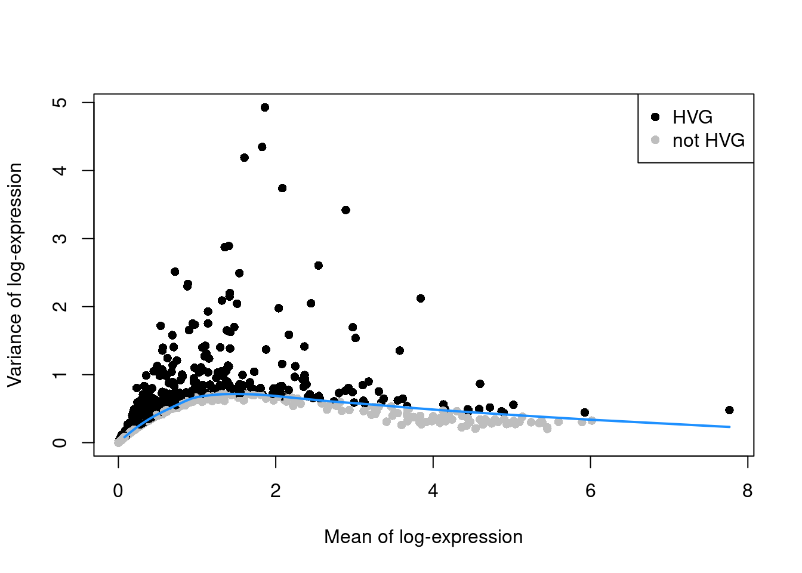
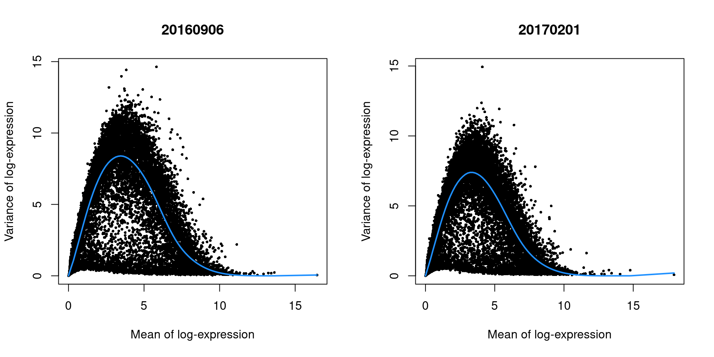
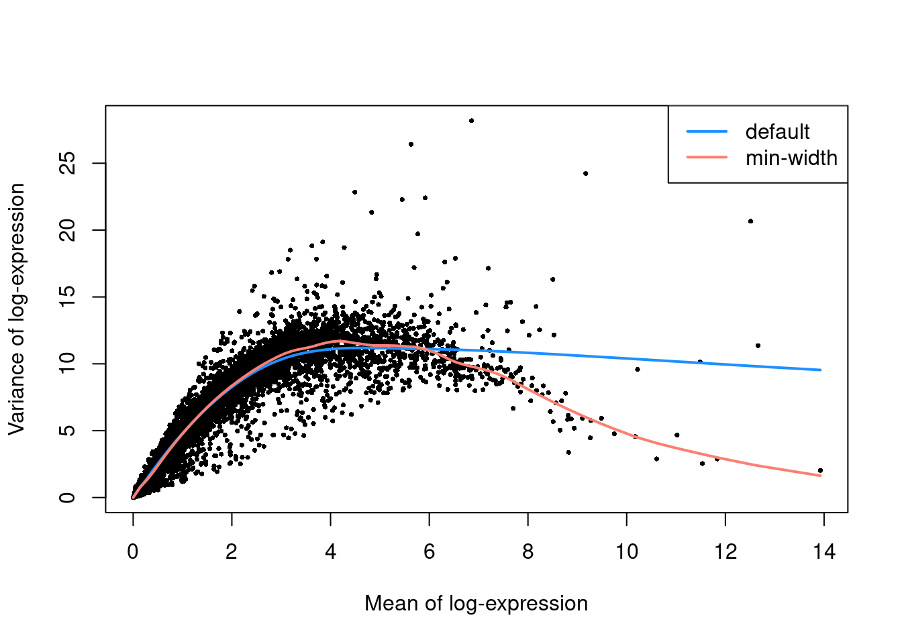
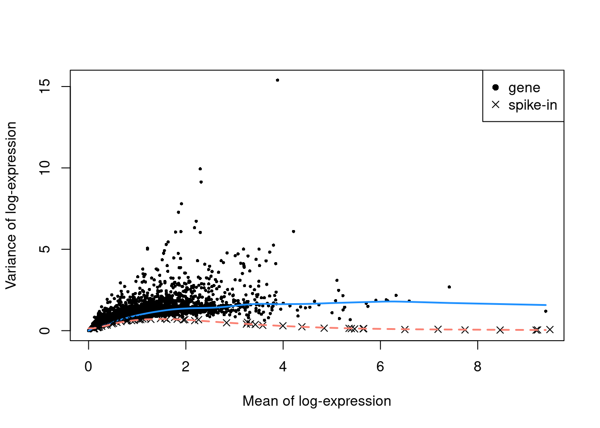

---
output:
  html_document
bibliography: ref.bib
---

# Feature selection 


## Motivation

We often use scRNA-seq data in exploratory analyses to characterize heterogeneity across the cell population.
Procedures like clustering and dimensionality reduction compare cells based on their gene expression profiles,
which involves aggregating per-gene differences into a single (dis)similarity metric between a pair of cells.
The choice of genes in this calculation has a major impact on the behavior of the metric and the performance of downstream methods.
We want to select genes that contain useful information about the biology of the system while removing genes that contain random noise.
In addition to improving signal, this reduces the size of the data to improve computational efficiency of later steps.

## Selecting highly variable genes

### Modelling the mean-variance trend

Our aim is to select the most highly variable genes (HVGs) based on their expression across the population.
This assumes that genuine biological differences will manifest as increased variation in the affected genes,
compared to other genes that are only affected by technical noise or a baseline level of "uninteresting" biological variation (e.g., from transcriptional bursting).
To demonstrate, we'll load the classic PBMC dataset from 10X Genomics [@zheng2017massively]:


``` r
# Loading in raw data from the 10X output files.
library(DropletTestFiles)
raw.path.10x <- getTestFile("tenx-2.1.0-pbmc4k/1.0.0/filtered.tar.gz")
dir.path.10x <- file.path(tempdir(), "pbmc4k")
untar(raw.path.10x, exdir=dir.path.10x)

library(DropletUtils)
fname.10x <- file.path(dir.path.10x, "filtered_gene_bc_matrices/GRCh38")
sce.10x <- read10xCounts(fname.10x, col.names=TRUE)

# Applying our default QC with outlier-based thresholds.
library(scrapper)
is.mito.10x <- grepl("^MT-", rowData(sce.10x)$Symbol)
sce.qc.10x <- quickRnaQc.se(sce.10x, subsets=list(MT=is.mito.10x))
sce.qc.10x <- sce.qc.10x[,sce.qc.10x$keep]

# Computing log-normalized expression values.
sce.norm.10x <- normalizeRnaCounts.se(sce.qc.10x, size.factors=sce.qc.10x$sum)
sce.norm.10x
```

```
## class: SingleCellExperiment 
## dim: 33694 4147 
## metadata(2): Samples qc
## assays(2): counts logcounts
## rownames(33694): ENSG00000243485 ENSG00000237613 ... ENSG00000277475
##   ENSG00000268674
## rowData names(2): ID Symbol
## colnames(4147): AAACCTGAGACAGACC-1 AAACCTGAGCGCCTCA-1 ...
##   TTTGTCAGTTAAGACA-1 TTTGTCATCCCAAGAT-1
## colData names(7): Sample Barcode ... keep sizeFactor
## reducedDimNames(0):
## mainExpName: NULL
## altExpNames(0):
```

We compute the variance of the log-normalized expression values for each gene across all cells [@lun2016step].
We then fit a trend to the variances with respect to the mean (Figure \@ref(fig:trend-plot-pbmc)).
HVGs are identified as the top $H$ genes with the largest residuals above the trend, where $H$ is typically between 1000 and 5000.
We use the variances of the log-transformed values to ensure that the feature selection is based on the same matrix values that are used in downstream steps.
Genes with the largest variances will contribute most to the distances between cells during procedures like clustering and dimensionality reduction.


``` r
sce.var.10x <- chooseRnaHvgs.se(sce.norm.10x)

# Let's have a peek at the statistics for the top HVGs.
rd.10x <- rowData(sce.var.10x)
ordered.residual.10x <- order(rd.10x$residuals, decreasing=TRUE)
rd.10x[head(ordered.residual.10x),c("Symbol", "means", "variances", "fitted", "residuals", "hvg")]
```

```
## DataFrame with 6 rows and 6 columns
##                      Symbol     means variances    fitted residuals       hvg
##                 <character> <numeric> <numeric> <numeric> <numeric> <logical>
## ENSG00000090382         LYZ   1.86235   4.92849  0.700584   4.22790      TRUE
## ENSG00000163220      S100A9   1.82739   4.34678  0.703548   3.64323      TRUE
## ENSG00000143546      S100A8   1.60171   4.18943  0.714048   3.47538      TRUE
## ENSG00000204287     HLA-DRA   2.08390   3.74121  0.676334   3.06487      TRUE
## ENSG00000019582        CD74   2.89021   3.41935  0.590209   2.82914      TRUE
## ENSG00000101439        CST3   1.40312   2.89004  0.714812   2.17523      TRUE
```

``` r
# Look at the number of top HVGs.
is.hvg.10x <- rowData(sce.var.10x)$hvg
sum(is.hvg.10x)
```

```
## [1] 4000
```

``` r
plot(rd.10x$means, rd.10x$variances,
    col=ifelse(is.hvg.10x, "black", "grey"), pch=16, cex=1,
    xlab="Mean of log-expression", ylab="Variance of log-expression")
legend("topright", col=c("black", "grey"), pch=16, legend=c("HVG", "not HVG"))

# Just using approxfun() to make a nice-looking curve for us.
trend.10x <- approxfun(rd.10x$means, rd.10x$fitted)
curve(trend.10x, add=TRUE, col="dodgerblue", lwd=2)
```

<div class="figure">

<p class="caption">(\#fig:trend-plot-pbmc)Variance of the log-normalized expression values across all genes in the PBMC data set, as a function of the mean. Each point represents a gene, colored according to whether it was chosen as a HVG. The blue line represents the trend fitted to all genes.</p>
</div>

We use residuals to select HVGs to account for the mean-variance relationship in scRNA-seq data.
Our assumption is that, at any given mean, the variation in expression for most genes is driven by uninteresting processes like sampling noise. 
The fitted value of the trend at any given gene's mean represents a mean-dependent estimate of its uninteresting variation,
while the residuals represent the "interesting" variation for each gene and can be used as the metric for HVG selection.
By comparison, if we just used the total variance without any trend, the choice of HVGs would be driven more by the gene's abundance than its biological heterogeneity. 
(In other words, the log-transformation is not a variance-stabilizing transformation^[
And even VSTs need to deal with a trend at small counts.
A gene with a mean of zero will also have a variance of zero, and the variance has to become positive with increasing mean, so at some point, a trend will manifest.].)
This would cause us to neglect lower-abundance genes that exhibit increased variation.

Once we have our top HVGs, we can use them in downstream steps like principal components analysis.
We'll discuss this more in Chapter \@ref(principal-components-analysis), but it is as simple as using only the subset of HVGs in the analysis:


``` r
sce.pcs.10x <- runPca.se(sce.var.10x, features=is.hvg.10x)
```

### Choosing the number of HVGs

How many HVGs should we use in our downstream analyses, i.e., what is the "best" value of $H$?
A larger set of HVGs will reduce the risk of discarding interesting biological signal by retaining more potentially relevant genes,
at the cost of adding noise from irrelevant genes that might obscure that signal.
It's difficult to determine the optimal trade-off for any given application as the distinction between noise and signal is context-dependent.
For example, variation in the activation status of certain immune cells may not be interesting when we only want to identify the cell types;
the former can even interfere with the latter by encouraging the formation of clusters based on activation strength instead.

Our recommendation is to simply pick a "reasonable" $H$ - usually somewhere between 1000 and 5000 - and proceed with the rest of the analysis.
If we can answer our scientific question, then our choice is good enough; if not, we can just try another value.
There's nothing wrong with trying different parameters during data exploration^[
It would be another story if we were doing some confirmatory analysis with rigorous hypothesis testing.
In such cases, it would be improper to shop around for the best parameters that gives us the result that we want.
Fortunately, single-cell analyses have looser standards as we often don't know what we're looking for.].
In fact, different choices of $H$ can provide new perspectives of the same dataset by changing the balance between signal and noise,
so we might discover new population structure that would not be apparent with other parameters.
Don't spend too much time worrying about obtaining the "optimal" value.

If we really want to ensure that all biological structure is preserved, we could define the set of HVGs as all genes with variances above the trend.
This avoids any judgement calls about the definition of "interesting" variation, giving an opportunity for weaker population structure to manifest.
It is most useful for rare and/or weakly-separated subpopulations where the relevant marker genes are not variable enough to sneak into the top $H$ genes.
The obvious cost is that more noise is also captured, which can reduce the resolution of subpopulations;
and we need to perform more computational work in each downstream step, as more genes are involved.


``` r
# Setting top=Inf to select all genes with positive residuals.
hvgs.all.10x <- chooseHighlyVariableGenes(rd.10x$residuals, top=Inf)
length(hvgs.all.10x)
```

```
## [1] 11679
```

``` r
# This can be used just like our other HVGs.
sce.all.10x <- runPca.se(sce.var.10x, features=hvgs.all.10x)
```

## Blocking on uninteresting factors {#variance-block}

Larger datasets may contain multiple blocks of cells that exhibit uninteresting differences in gene expression, e.g., batch effects, variability between donors.
We are not interested in HVGs that are driven by these differences; instead, we want to focus on genes that are highly variable within each block.
We demonstrate using some trophoblast scRNA-seq data generated across two plates [@lun2017assessing]:


``` r
library(scRNAseq)
sce.tropho <- LunSpikeInData("tropho")
table(sce.tropho$block) # i.e., the plate of origin. 
```

```
## 
## 20160906 20170201 
##       96       96
```

``` r
# Computing the QC metrics.
library(scrapper)
is.mito.tropho <- which(any(seqnames(rowRanges(sce.tropho))=="MT"))
sce.qc.tropho <- quickRnaQc.se(
    sce.tropho,
    subsets=list(MT=is.mito.tropho),
    altexp.proportions="ERCC",
    block=sce.tropho$block
)
sce.qc.tropho <- sce.qc.tropho[,sce.qc.tropho$keep]

# Computing log-normalized expression values.
sce.norm.tropho <- normalizeRnaCounts.se(
    sce.qc.tropho,
    size.factors=sce.qc.tropho$sum,
    block=sce.qc.tropho$block
)
```

Setting `block=` instructs `chooseRnaHvgs.se()` to compute the mean and variance for each gene within each plate.
This ensures that any systematic technical differences between plates (e.g., in sequencing depth) will not inflate the variance estimates.
It will also fit a separate trend for each plate, which accommodates differences in the mean-variance relationships between plates.
In this case, there are only minor differences between the trends in Figure \@ref(fig:trend-plot-tropho), which indicates that the experiment was tightly replicated across plates.


``` r
sce.var.tropho <- chooseRnaHvgs.se(
    sce.norm.tropho,
    block=sce.qc.tropho$block,
    include.per.block=TRUE # only needed for plotting.
)

per.block <- rowData(sce.var.tropho)$per.block
par(mfrow=c(1,2))
for (block in colnames(per.block)) {
    current <- per.block[[block]]
    plot(current$means, current$variances,
        xlab="Mean of log-expression",
        ylab="Variance of log-expression",
        main=block, pch=16, cex=0.5)
    trend <- approxfun(current$means, current$fitted)
    curve(trend, add=TRUE, col="dodgerblue", lwd=2)
}
```

<div class="figure">

<p class="caption">(\#fig:trend-plot-tropho)Variance of the log-normalized expression values across all genes in the trophoblast data set, as a function of the mean after blocking on the plate of origin. Each plot represents the results for a single plate. Each point represents a gene and the fitted trend is shown in blue.</p>
</div>

`chooseRnaHVgs.se()` also combines information across blocks by reporting the weighted mean of each statistic,
where the weight is determined by the size of number of cells in each plate.
We use the mean residuals to select our top HVGs as described previously.
This ensures that each block contributes some information about the variability of each gene.
High variability in any block can increase the residual for a gene, giving it an opportunity to be selected as a HVG.


``` r
rowData(sce.var.tropho)[,c("means", "variances", "fitted", "residuals")] # mean across blocks.
```

```
## DataFrame with 46603 rows and 4 columns
##                        means variances    fitted residuals
##                    <numeric> <numeric> <numeric> <numeric>
## ENSMUSG00000102693 0.0000000  0.000000  0.000000 0.0000000
## ENSMUSG00000064842 0.0000000  0.000000  0.000000 0.0000000
## ENSMUSG00000051951 0.0351964  0.190773  0.145564 0.0452092
## ENSMUSG00000102851 0.0000000  0.000000  0.000000 0.0000000
## ENSMUSG00000103377 0.0993010  0.536793  0.389798 0.1469946
## ...                      ...       ...       ...       ...
## ENSMUSG00000094431         0         0         0         0
## ENSMUSG00000094621         0         0         0         0
## ENSMUSG00000098647         0         0         0         0
## ENSMUSG00000096730         0         0         0         0
## ENSMUSG00000095742         0         0         0         0
```

``` r
hvgs.tropho <- rowData(sce.var.tropho)$hvg
sum(hvgs.tropho)
```

```
## [1] 4000
```

Alternatively, we could focus on genes are consistently variable within each block by asking `chooseRnaHvgs.se()` to compute a quantile instead of a weighted mean.
For example, we could report the minimum residual across blocks, which means that genes will only be considered as HVGs if they have large positive residuals in each block.
This tends to scale poorly as it becomes too stringent with a large number of blocks.


``` r
sce.var.min.tropho <- chooseRnaHvgs.se(
    sce.norm.tropho,
    block=sce.qc.tropho$block,
    more.var.args=list(
        block.average.policy="quantile",
        block.quantile=0 # i.e., minimum.
    )
)
rowData(sce.var.min.tropho)[,c("means", "variances", "fitted", "residuals")] # minimum across blocks.
```

```
## DataFrame with 46603 rows and 4 columns
##                        means variances    fitted residuals
##                    <numeric> <numeric> <numeric> <numeric>
## ENSMUSG00000102693 0.0000000  0.000000  0.000000  0.000000
## ENSMUSG00000064842 0.0000000  0.000000  0.000000  0.000000
## ENSMUSG00000051951 0.0000000  0.000000  0.000000  0.000000
## ENSMUSG00000102851 0.0000000  0.000000  0.000000  0.000000
## ENSMUSG00000103377 0.0780524  0.469098  0.322909  0.146189
## ...                      ...       ...       ...       ...
## ENSMUSG00000094431         0         0         0         0
## ENSMUSG00000094621         0         0         0         0
## ENSMUSG00000098647         0         0         0         0
## ENSMUSG00000096730         0         0         0         0
## ENSMUSG00000095742         0         0         0         0
```

It is generally expected that `block=` will be used for uninteresting factors of variation.
In this case, the plate of origin is a technical factor that should be ignored. 
However, imagine instead that each plate corresponds to a different treatment condition.
In such cases, we might not use `block=` to ensure that our variance estimates can capture the differences between treatments.
We discuss these considerations in more detail in Chapter \@ref(batch-correction).

As an aside, the wave-like shape observed in Figure \@ref(fig:trend-plot-tropho) is typical of the mean-variance relationship in log-expression values.
A linear increase in the variance is observed as the mean increases from zero, as larger variances are obviously possible when the counts are not all equal to zero.
In contrast, the relative contribution of sampling noise decreases at high abundances, resulting in a downward trend.
The peak represents the point at which these two competing effects cancel each other out.

## Refining the trend fit

The trend fit in `chooseRnaHvgs.se()` uses the LOWESS non-parametric smoother [@cleveland1979robust] by default.
This slides a window across the x-coordinates and performs a linear regression within each window to obtain the fitted value for the point at the window's center.
The size of the window varies between points, expanding or contracting until it contains some proportion of all points in the dataset (by default, 30%).
This mostly works well but can be suboptimal in very sparse intervals of the x-axis.
To demonstrate, let's have a look at a human pancreas dataset from @segerstolpe2016singlecell:


``` r
library(scRNAseq)
sce.seger <- SegerstolpePancreasData()

# For simplicity, we'll focus on one of the donors. 
sce.seger <- sce.seger[,sce.seger$individual=="H2"]

# For reasons unknown to us, the data supplied by the authors contain
# duplicated row names, so we'll just get rid of those to avoid confusion.
sce.seger <- sce.seger[!duplicated(rownames(sce.seger)),]

# Running QC. Seems like they don't have any data for the mitochondrial genes,
# unfortunately, but they do have spike-ins so we'll just use those instead.
library(scrapper)
sce.qc.seger <- quickRnaQc.se(sce.seger, subsets=list(), altexp.proportions="ERCC")

# Computing log-normalized expression values.
sce.norm.seger <- normalizeRnaCounts.se(sce.qc.seger, size.factors=sce.qc.seger$sum)
```

There are very few genes at high abundances, which forces the LOWESS window to expand to contain more points.
This reduces sensitivity of the fitted trend to the behavior of the high-abundance genes (Figure \@ref(fig:trend-plot-seger)).
We can improve the fit by tinkering with some of the trend fitting options.
In particular, setting `use.min.width=TRUE` will switch to a different strategy to defining the window around each point,
which improves sensitivity in sparse intervals at the risk of overfitting.


``` r
sce.default.seger <- chooseRnaHvgs.se(sce.norm.seger)
sce.minw.seger <- chooseRnaHvgs.se(sce.norm.seger, more.var.args=list(use.min.width=TRUE))

rd.default.seger <- rowData(sce.default.seger)
plot(rd.default.seger$means, rd.default.seger$variances,
    xlab="Mean of log-expression", ylab="Variance of log-expression", pch=16, cex=0.5)
trend.default.seger <- approxfun(rd.default.seger$means, rd.default.seger$fitted)
curve(trend.default.seger, add=TRUE, col="dodgerblue", lwd=2)

rd.minw.seger <- rowData(sce.minw.seger)
trend.minw.seger <- approxfun(rd.minw.seger$means, rd.minw.seger$fitted)
curve(trend.minw.seger, add=TRUE, col="salmon", lwd=2)
legend("topright", lwd=2, col=c("dodgerblue", "salmon"), legend=c("default", "min-width"))
```

<div class="figure">

<p class="caption">(\#fig:trend-plot-seger)Variance of the log-normalized expression values across all genes in one donor of the Segerstople pancreas data set, as a function of the mean. Each point represents a gene while the lines represent trends fitted with different parameters.</p>
</div>

In practice, the parametrization of the trend fitting doesn't matter all that much.
There are so few genes in these sparse intervals that their (lack of) selection as HVGs won't have a major effect on downstream analyses.
But sometimes it's just nice to look at some well-fitted curves.

## Selecting _a priori_ genes of interest

A blunt yet effective feature selection strategy is to use pre-defined sets of interesting genes.
The aim is to focus on specific aspects of biological heterogeneity that may be masked by other factors when using unsupervised methods for HVG selection.
For example, to study transcriptional changes during the earliest stages of cell fate commitment [@messmer2019transcriptional],
we might focus only on lineage markers to avoid interference from variability in other pathways (e.g., cell cycle, metabolism).
Using scRNA-seq data in this manner is conceptually equivalent to a fluorescence activated cell sorting (FACS) experiment,
with the convenience of being able to (re)define the features of interest at any time.
We provide some examples of _a priori_ selection based on MSigDB gene sets [@liberzon2015msigdb] below:


``` r
library(msigdbr)
c7.sets <- msigdbr(species = "Homo sapiens", category = "C7")
head(unique(c7.sets$gs_name))
```

```
## [1] "ANDERSON_BLOOD_CN54GP140_ADJUVANTED_WITH_GLA_AF_AGE_18_45YO_1DY_DN"
## [2] "ANDERSON_BLOOD_CN54GP140_ADJUVANTED_WITH_GLA_AF_AGE_18_45YO_1DY_UP"
## [3] "ANDERSON_BLOOD_CN54GP140_ADJUVANTED_WITH_GLA_AF_AGE_18_45YO_3DY_DN"
## [4] "ANDERSON_BLOOD_CN54GP140_ADJUVANTED_WITH_GLA_AF_AGE_18_45YO_3DY_UP"
## [5] "ANDERSON_BLOOD_CN54GP140_ADJUVANTED_WITH_GLA_AF_AGE_18_45YO_6HR_DN"
## [6] "ANDERSON_BLOOD_CN54GP140_ADJUVANTED_WITH_GLA_AF_AGE_18_45YO_6HR_UP"
```

``` r
# Using the Goldrath sets to distinguish CD8 subtypes
cd8.sets <- c7.sets[grep("GOLDRATH", c7.sets$gs_name),]
cd8.genes <- rownames(sce.10x) %in% cd8.sets$ensembl_gene
summary(cd8.genes)
```

```
##    Mode   FALSE    TRUE 
## logical   32851     843
```

``` r
# Using GSE11924 to distinguish between T helper subtypes
th.sets <- c7.sets[grep("GSE11924", c7.sets$gs_name),]
th.genes <- rownames(sce.10x) %in% th.sets$ensembl_gene
summary(th.genes)
```

```
##    Mode   FALSE    TRUE 
## logical   31722    1972
```

``` r
# Using GSE11961 to distinguish between B cell subtypes
b.sets <- c7.sets[grep("GSE11961", c7.sets$gs_name),]
b.genes <- rownames(sce.10x) %in% b.sets$ensembl_gene
summary(b.genes)
```

```
##    Mode   FALSE    TRUE 
## logical   27995    5699
```

Don't be ashamed to take advantage of prior biological knowledge during feature selection to address specific hypotheses!
We say this because a common refrain in genomics is that the data analysis should be "unbiased", i.e., free from any biological preconceptions.
Which is fine and all, but such "biases" are already present at every stage, starting with experimental design and ending with the interpretation of the data.
So if we already know what we're looking for, why not make life simpler and just go for it?
Of course, the downside of focusing on pre-defined genes is that it will limit our capacity to detect novel or unexpected aspects of variation.
Thus, this kind of focused analysis should be complementary to (rather than a replacement for) the unsupervised feature selection strategies discussed above.

Alternatively, we can invert this reasoning to remove genes that are unlikely to be of interest prior to downstream analyses. 
This eliminates unwanted variation that could mask relevant biology and interfere with interpretation of the results.
Ribosomal protein genes or mitochondrial genes are common candidates for removal,
especially in situations with varying levels of cell damage within a population.
For immune cell subsets, we might also be inclined to remove immunoglobulin genes and T cell receptor genes 
for which clonal expression introduces (possibly irrelevant) population structure.


``` r
# Identifying ribosomal proteins:
ribo.discard <- grepl("^RP[SL]\\d+", rowData(sce.10x)$Symbol)
sum(ribo.discard)
```

```
## [1] 99
```

``` r
# A more curated approach for identifying ribosomal protein genes:
c2.sets <- msigdbr(species = "Homo sapiens", category = "C2")
ribo.set <- c2.sets[c2.sets$gs_name=="KEGG_RIBOSOME",]$ensembl_gene
ribo.discard <- rownames(sce.10x) %in% ribo.set
sum(ribo.discard)
```

```
## [1] 87
```

``` r
library(AnnotationHub)
edb <- AnnotationHub()[["AH73881"]]
anno <- select(edb, keys=rowData(sce.10x)$ID, keytype="GENEID", 
    columns="TXBIOTYPE")

# Removing immunoglobulin variable chains:
igv.set <- anno$GENEID[anno$TXBIOTYPE %in% c("IG_V_gene", "IG_V_pseudogene")]
igv.discard <- rownames(sce.10x) %in% igv.set
sum(igv.discard)
```

```
## [1] 326
```

``` r
# Removing TCR variable chains:
tcr.set <- anno$GENEID[anno$TXBIOTYPE %in% c("TR_V_gene", "TR_V_pseudogene")]
tcr.discard <- rownames(sce.10x) %in% tcr.set
sum(tcr.discard)
```

```
## [1] 138
```

In practice, we tend to err on the side of caution and abstain from preemptive filtering on biological function 
until these genes are demonstrably problematic in downstream analyses.

## Quantifying technical noise

Back in the old days, everyone was obsessed with modelling the gene-wise variability in scRNA-seq data [@brennecke2013accounting;@vallejos2015basics;@kim2015characterizing].
Spike-in transcripts were critical to this effort as they allowed us to decompose each gene's variance into technical and biological components. 
As spike-ins should not be subject to biological effects, the variance in spike-in expression could be used as an estimate of the technical component. 
Subtracting this from the variance of an endogenous gene at a similar abundance would then yield an estimate of the biological component.
Sadly, those days are gone and people don't care about variance decomposition anymore.
But for old times' sake, we'll demonstrate how to do this with the @zeisel2015brain dataset:


``` r
library(scRNAseq)
sce.zeisel <- ZeiselBrainData()
is.mito.zeisel <- rowData(sce.zeisel)$featureType=="mito"

# Performing some QC to set up the dataset prior to normalization.
library(scrapper)
sce.qc.zeisel <- quickRnaQc.se(sce.zeisel, subsets=list(MT=is.mito.zeisel), altexp.proportions="ERCC")
sce.qc.zeisel <- sce.qc.zeisel[,sce.qc.zeisel$keep]
```

We compute log-normalized expression values for endogenous genes and spike-in transcripts with their respective size factors.
We still use the library size factors for the endogenous genes as we are not interested in changes in total RNA content.
Both sets of size factors are centered to preserve the scale of the original counts, ensuring that normalized abundances are comparable between genes and spike-ins.
(This is a bit more complicated with blocking, as the mean of the spike-in factors within each block must be scaled to the mean of the library size factors in that block;
for brevity, we won't show that here.)


``` r
sce.norm.zeisel <- normalizeRnaCounts.se(sce.qc.zeisel, size.factors=sce.qc.zeisel$sum)
sce.ercc <- altExp(sce.norm.zeisel, "ERCC")
sce.norm.ercc <- normalizeRnaCounts.se(sce.ercc, size.factors=sce.ercc$sum)
```

We fit separate mean-dependent trends to the endogenous genes and spike-in transcripts (Figure \@ref(fig:trend-plot-spike-in)).
At any given mean, the fitted value of the spike-in trend represents an estimate of the techical component of the variance.
This assumes that an endogenous gene is subject to the same technical noise as a spike-in transcript of the same abundance.


``` r
sce.var.zeisel <- chooseRnaHvgs.se(sce.norm.zeisel, more.var.args=list(use.min.width=TRUE))
sce.var.ercc <- chooseRnaHvgs.se(sce.norm.ercc)

var.zeisel <- rowData(sce.var.zeisel)
plot(var.zeisel$means, var.zeisel$variances,
    xlab="Mean of log-expression", ylab="Variance of log-expression", pch=16, cex=0.5)
trend.gene.zeisel <- approxfun(var.zeisel$means, var.zeisel$fitted)
curve(trend.gene.zeisel, add=TRUE, col="dodgerblue", lwd=2)

var.ercc <- rowData(sce.var.ercc)
points(var.ercc$means, var.ercc$variances, pch=4)
trend.spike.zeisel <- approxfun(var.ercc$means, var.ercc$fitted, rule=2)
curve(trend.spike.zeisel, add=TRUE, col="salmon", lwd=2, lty=2)

legend("topright", c("gene", "spike-in"), pch=c(16, 4))
```

<div class="figure">

<p class="caption">(\#fig:trend-plot-spike-in)Variance of endogenous genes and spike-in transcripts in the Zeisel brain dataset, as a function of the mean. Separate trends are fitted to the genes (blue) and spike-ins (red).</p>
</div>

To decompose each gene's variance into the technical and biological components,
we estimate the fitted value of the spike-in trend at that gene's mean and subtract it from the gene's total variance.
We could then use the biological component to select HVGs via `chooseHighlyVariableGenes()`.


``` r
tech.var.zeisel <- trend.spike.zeisel(var.zeisel$means)
summary(tech.var.zeisel)
```

```
##    Min. 1st Qu.  Median    Mean 3rd Qu.    Max. 
##  0.0398  0.1453  0.1478  0.2691  0.3582  0.7162
```

``` r
bio.var.zeisel <- var.zeisel$variances - tech.var.zeisel
summary(bio.var.zeisel)
```

```
##     Min.  1st Qu.   Median     Mean  3rd Qu.     Max. 
## -0.14529 -0.13304 -0.00356  0.07844  0.12841 15.08152
```

In practice, this doesn't provide much benefit over the residuals from the trend fitted to the endogenous genes.
Oh well.

## Session information {-}


``` r
sessionInfo()
```

```
## R Under development (unstable) (2025-12-24 r89227)
## Platform: x86_64-pc-linux-gnu
## Running under: Ubuntu 22.04.5 LTS
## 
## Matrix products: default
## BLAS:   /home/luna/Software/R/trunk/lib/libRblas.so 
## LAPACK: /home/luna/Software/R/trunk/lib/libRlapack.so;  LAPACK version 3.12.1
## 
## locale:
##  [1] LC_CTYPE=en_US.UTF-8       LC_NUMERIC=C              
##  [3] LC_TIME=en_US.UTF-8        LC_COLLATE=en_US.UTF-8    
##  [5] LC_MONETARY=en_US.UTF-8    LC_MESSAGES=en_US.UTF-8   
##  [7] LC_PAPER=en_US.UTF-8       LC_NAME=C                 
##  [9] LC_ADDRESS=C               LC_TELEPHONE=C            
## [11] LC_MEASUREMENT=en_US.UTF-8 LC_IDENTIFICATION=C       
## 
## time zone: Australia/Sydney
## tzcode source: system (glibc)
## 
## attached base packages:
## [1] stats4    stats     graphics  grDevices utils     datasets  methods  
## [8] base     
## 
## other attached packages:
##  [1] AnnotationHub_4.1.0         BiocFileCache_3.1.0        
##  [3] dbplyr_2.5.1                msigdbr_25.1.1             
##  [5] ensembldb_2.35.0            AnnotationFilter_1.35.0    
##  [7] GenomicFeatures_1.63.1      AnnotationDbi_1.73.0       
##  [9] scRNAseq_2.25.0             scrapper_1.5.10            
## [11] DropletUtils_1.31.0         SingleCellExperiment_1.33.0
## [13] SummarizedExperiment_1.41.0 Biobase_2.71.0             
## [15] GenomicRanges_1.63.1        Seqinfo_1.1.0              
## [17] IRanges_2.45.0              S4Vectors_0.49.0           
## [19] BiocGenerics_0.57.0         generics_0.1.4             
## [21] MatrixGenerics_1.23.0       matrixStats_1.5.0          
## [23] DropletTestFiles_1.21.0    
## 
## loaded via a namespace (and not attached):
##   [1] DBI_1.2.3                 bitops_1.0-9             
##   [3] httr2_1.2.2               rlang_1.1.7              
##   [5] magrittr_2.0.4            otel_0.2.0               
##   [7] gypsum_1.7.0              compiler_4.6.0           
##   [9] RSQLite_2.4.5             DelayedMatrixStats_1.33.0
##  [11] png_0.1-8                 vctrs_0.6.5              
##  [13] ProtGenerics_1.43.0       pkgconfig_2.0.3          
##  [15] crayon_1.5.3              fastmap_1.2.0            
##  [17] XVector_0.51.0            scuttle_1.21.0           
##  [19] Rsamtools_2.27.0          rmarkdown_2.30           
##  [21] UCSC.utils_1.7.1          purrr_1.2.1              
##  [23] bit_4.6.0                 xfun_0.55                
##  [25] cachem_1.1.0              beachmat_2.27.1          
##  [27] cigarillo_1.1.0           GenomeInfoDb_1.47.2      
##  [29] jsonlite_2.0.0            blob_1.2.4               
##  [31] rhdf5filters_1.23.3       DelayedArray_0.37.0      
##  [33] Rhdf5lib_1.33.0           BiocParallel_1.45.0      
##  [35] parallel_4.6.0            R6_2.6.1                 
##  [37] bslib_0.9.0               limma_3.67.0             
##  [39] rtracklayer_1.71.3        jquerylib_0.1.4          
##  [41] assertthat_0.2.1          Rcpp_1.1.1               
##  [43] bookdown_0.46             knitr_1.51               
##  [45] R.utils_2.13.0            Matrix_1.7-4             
##  [47] tidyselect_1.2.1          abind_1.4-8              
##  [49] yaml_2.3.12               codetools_0.2-20         
##  [51] curl_7.0.0                alabaster.sce_1.11.0     
##  [53] lattice_0.22-7            tibble_3.3.0             
##  [55] withr_3.0.2               KEGGREST_1.51.1          
##  [57] evaluate_1.0.5            alabaster.schemas_1.11.0 
##  [59] ExperimentHub_3.1.0       Biostrings_2.79.4        
##  [61] pillar_1.11.1             BiocManager_1.30.27      
##  [63] filelock_1.0.3            RCurl_1.98-1.17          
##  [65] BiocVersion_3.23.1        alabaster.base_1.11.1    
##  [67] sparseMatrixStats_1.23.0  alabaster.ranges_1.11.0  
##  [69] glue_1.8.0                lazyeval_0.2.2           
##  [71] alabaster.matrix_1.11.0   tools_4.6.0              
##  [73] BiocIO_1.21.0             BiocNeighbors_2.5.0      
##  [75] GenomicAlignments_1.47.0  locfit_1.5-9.12          
##  [77] babelgene_22.9            XML_3.99-0.20            
##  [79] rhdf5_2.55.12             grid_4.6.0               
##  [81] edgeR_4.9.2               HDF5Array_1.39.0         
##  [83] restfulr_0.0.16           cli_3.6.5                
##  [85] rappdirs_0.3.3            S4Arrays_1.11.1          
##  [87] dplyr_1.1.4               alabaster.se_1.11.0      
##  [89] R.methodsS3_1.8.2         sass_0.4.10              
##  [91] digest_0.6.39             SparseArray_1.11.10      
##  [93] dqrng_0.4.1               rjson_0.2.23             
##  [95] memoise_2.0.1             htmltools_0.5.9          
##  [97] R.oo_1.27.1               lifecycle_1.0.5          
##  [99] h5mread_1.3.1             httr_1.4.7               
## [101] statmod_1.5.1             bit64_4.6.0-1
```
