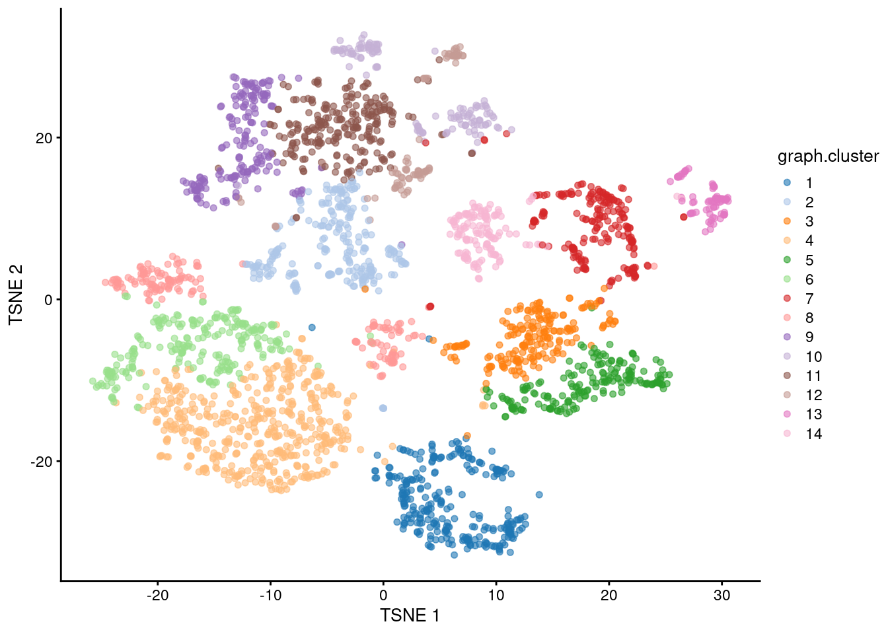

--- 
title: "Single-cell RNA-seq analysis with scrapper"
documentclass: book
bibliography: [ref.bib]
biblio-style: apalike
link-citations: yes
favicon: "favicon.ico"
description: "Or: how I learned to stop worrying and love the t-SNEs."
cover-image: "https://github.com/Bioconductor/BiocStickers/raw/devel/Bioconductor/Bioconductor-serial.gif"
github-repo: libscran/scrapbook
---


---
author: 
- name: Aaron Lun [aut, cre]
url: "https://github.com/libscran/scrapbook"
---

# Introduction {-}

<a href="https://bioconductor.org"></a> 

Single-cell RNA-sequencing (scRNA-seq) - the name says it all, really.
Long story short, we isolate single cells and we sequence their transcriptomes to quantify the expression of each gene in each cell [@kolodziejczyk2015technology].
Our aim is to explore heterogeneity in a cell population at the resolution of individual cells,
typically to identify subpopulations or states that would not be apparent from population-level (i.e., "bulk") assays.
Since its inception, scRNA-seq has emerged as one of the premier techniques for publishing genomics papers.
Occasionally, it is even used to do some actual science.

This book describes a computational workflow for analyzing scRNA-seq data using the [R/Bioconductor](https://bioconductor.org) ecosystem
[@huber2015orchestrating;@lun2016step;@amezquita2020orchestrating].
Most of the heavy lifting is performed using the *[scrapper](https://bioconductor.org/packages/3.23/scrapper)* package, while *[scater](https://bioconductor.org/packages/3.23/scater)* handles the plotting [@mccarthy2017scater].
We rely heavily on Bioconductor data structures like the `SingleCellExperiment` class,
so readers should check out the [associated documentation](https://bioconductor.org/packages/3.23/SingleCellExperiment/vignettes/intro.html) if they haven't already.
Each chapter is devoted to a particular step in the analysis where we provide its theoretical rationale, the associated code, and some typical results from real public datasets.
This includes:

- Quality control, to filter out cells that were damaged or not properly sequenced.
- Normalization, to remove cell-specific biases. 
- Feature selection, to identify genes with interesting biologial variation.
- Principal components analysis, to compact and denoise the data.
- Visualization, to generate the all-important Figure 1 of our manuscript.
- Clustering, to summarize the data into groups of similar cells. 
- Marker detection, to assign biological meaning to each cluster based on its upregulated genes.

Truth be told, you don't actually need to read this book if you don't care about how/why things are done.
Just copy and paste the following into your R session:


``` r
# Pulling out an example dataset.
library(scRNAseq)
sce.zeisel <- ZeiselBrainData()

# Running the full analysis pipeline.
library(scrapper)
is.mito.zeisel <- grep("^mt-", rownames(sce.zeisel))
res.zeisel <- analyze.se(sce.zeisel, rna.qc.subsets=list(MT=is.mito.zeisel))

# Visualizing the cluster assignments for each cell:
library(scater)
plotReducedDim(res.zeisel$x, "TSNE", colour_by="graph.cluster")
```



``` r
# Looking at the top markers for cluster 1:
previewMarkers(res.zeisel$markers$rna[["1"]])
```

```
## DataFrame with 10 rows and 3 columns
##              mean  detected       lfc
##         <numeric> <numeric> <numeric>
## Gad1      4.79503  1.000000   4.56949
## Gad2      4.44192  0.996503   4.25766
## Ndrg4     4.40310  0.996503   2.59179
## Vstm2a    2.94119  0.965035   2.67985
## Stmn3     4.71546  0.993007   2.64538
## Slc6a1    3.75820  0.993007   3.08908
## Tspyl4    3.36568  1.000000   2.15128
## Nap1l5    4.32495  1.000000   3.09812
## Rab3c     3.91161  0.982517   2.98746
## Slc32a1   2.04411  0.909091   2.01340
```

And that's it.
Sometimes, ignorance is bliss, and it's better to not know how the sausage is made.
But hey - you're already here, so why not keep reading?

Any questions can be posted at [Bioconductor support site](https://support.bioconductor.org) or the [GitHub page for this book](https://github.com/libscran/scrapbook).
