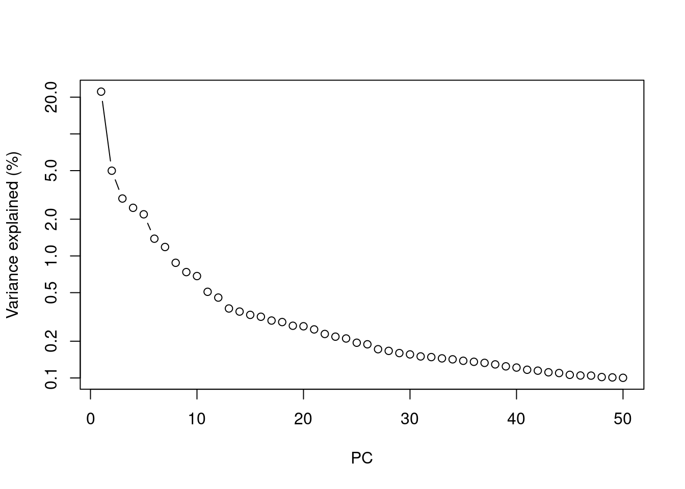
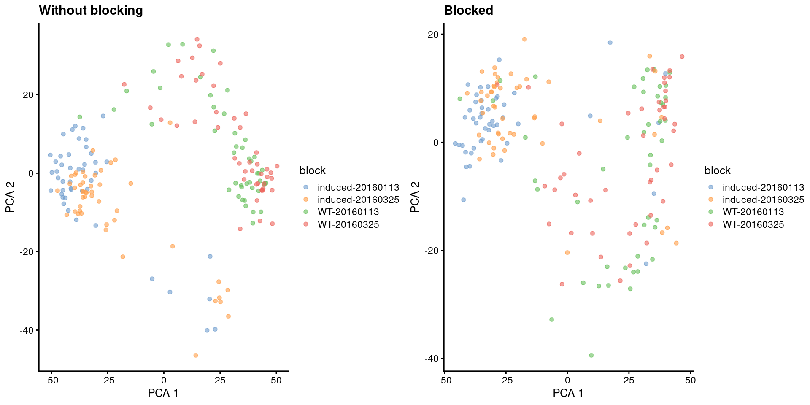
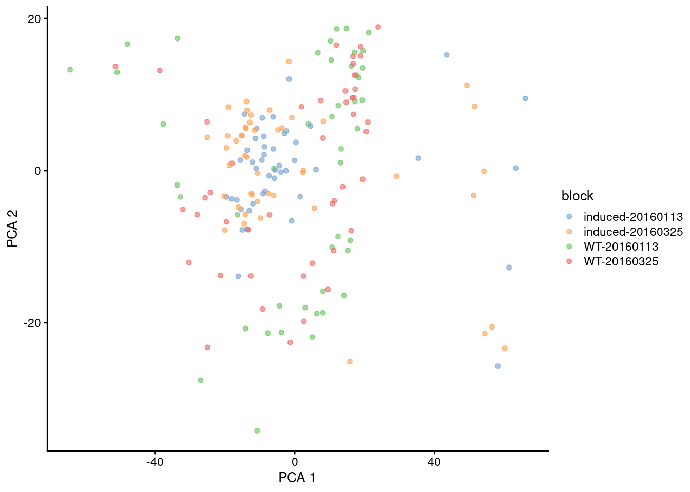
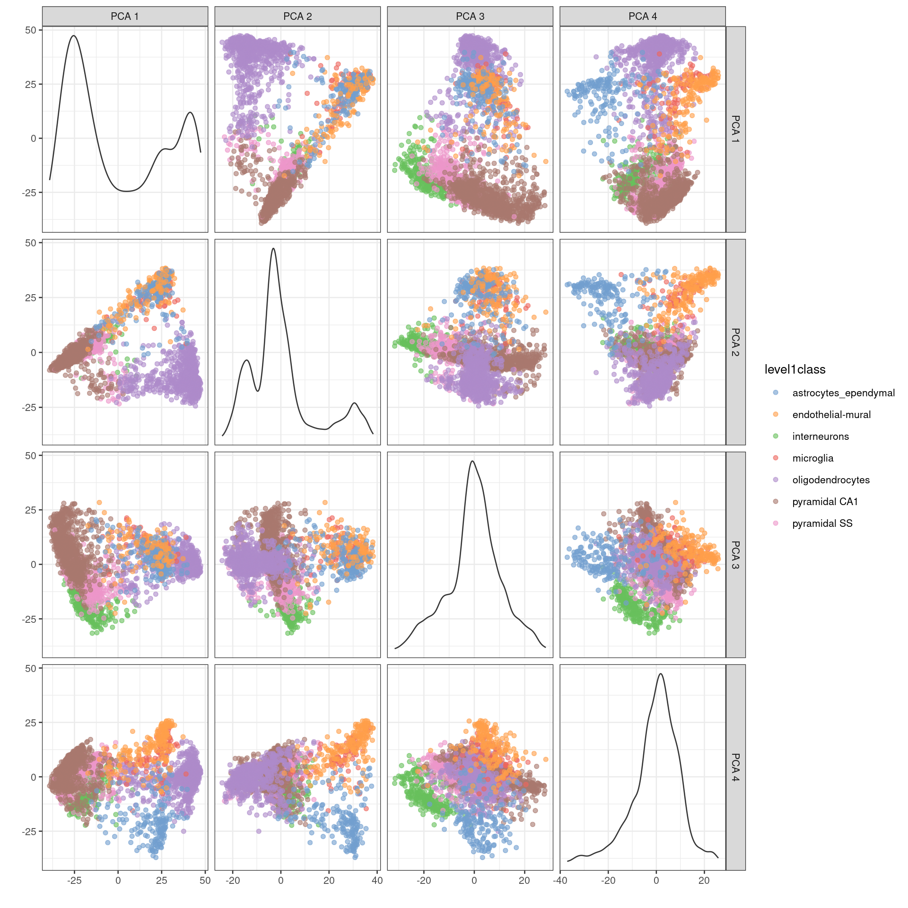

---
output:
  html_document
bibliography: ref.bib
---

# Principal components analysis


## Motivation

Principal components analysis (PCA) is commonly used to clean up and compact the log-normalized expression matrix.
Consider each gene as a dimension of our dataset where the cells are the observations,
i.e., each cell's expression profile defines its location in the high-dimensional expression space.
PCA discovers axes in this high-dimensional space that capture the largest amount of variation [@pearson1901lines].
Each principal component (PC) corresponds to an axis in this space, where the earliest PCs capture the dominant factors of heterogeneity in our data.
The idea is to use the first few PCs to approximate our original dataset^[
And in fact, PCA does provide the optimal low-rank approximation, based on its relation to the SVD and the Eckart-Young-Mirsky theorem.
This is arguably one of the rare cases of mathematical rigor in this entire book.].
Similarly, the Euclidean distances between cells in the PC space approximate the same distances in the original dataset.
This effectively compresses multiple genes into a single dimension, e.g., an "eigengene" [@langfelder2007eigengene],
and allows us to use a much smaller matrix in downstream steps like clustering.

## Getting the top PCs

Our assumption is that biological processes affect multiple genes in a coordinated manner.
This means that the earlier PCs are likely to represent biological structure as more variation can be captured by considering the correlated behavior of many genes.
In contrast, random technical or biological noise is expected to affect each gene independently.
There is unlikely to be an axis that can capture random variation across many genes, meaning that noise should mostly be concentrated in the later PCs.
By retaining the earlier PCs, we can focus on the biological signal while removing random noise.
To demonstrate, we'll pull out our favorite mouse brain dataset from @zeisel2015brain:


``` r
library(scRNAseq)
sce.zeisel <- ZeiselBrainData()
is.mito.zeisel <- rowData(sce.zeisel)$featureType=="mito"

# Performing some QC to set up the dataset prior to normalization. 
library(scrapper)
sce.qc.zeisel <- quickRnaQc.se(sce.zeisel, subsets=list(MT=is.mito.zeisel), altexp.proportions="ERCC")
sce.qc.zeisel <- sce.qc.zeisel[,sce.qc.zeisel$keep]

# Computing log-normalized expression values.
sce.norm.zeisel <- normalizeRnaCounts.se(sce.qc.zeisel, size.factors=sce.qc.zeisel$sum)

# Computing the variances.
sce.var.zeisel <- chooseRnaHvgs.se(sce.norm.zeisel, more.var.args=list(use.min.width=TRUE))
```

We run the PCA on our HVG-filtered log-normalized expression matrix, compacting the dataset into the top 25 PCs.
This yields a matrix of "PC scores", i.e., the coordinates for each cell in the new low-dimensional space, which can be used in clustering, visualization, etc.
As discussed in Chapter \@ref(feature-selection), we restrict this step to the top HVGs to reduce the impact of random noise. 
While PCA is robust to noise, too much of it may cause the earlier PCs to ignore meaningful structure [@johnstone2009consistency].


``` r
hvgs.zeisel <- rowData(sce.var.zeisel)$hvg
summary(hvgs.zeisel)
```

```
##    Mode   FALSE    TRUE 
## logical   16006    4000
```

``` r
sce.pca.zeisel <- runPca.se(sce.var.zeisel, features=hvgs.zeisel, number=25)
dim(reducedDim(sce.pca.zeisel, "PCA"))
```

```
## [1] 2866   25
```

## How many PCs?

The million dollar question is, how many of the top PCs should we retain for downstream analyses?
Using more PCs will retain more biological signal at the cost of including more noise that might mask that signal.
As with the number of HVGs, it is hard to determine whether an "optimal" choice exists here.
Sure, technical variation is almost always uninteresting,
but there is no straightforward way to automatically determine which aspects of biological variation are relevant to a particular scientific question.
For example, heterogeneity within a population might be interesting when studying continuous processes like metabolic flux or differentiation potential,
but could be considered noise in applications that only aim to distinguish between distinct cell types.

Most practitioners will simply set $d$ to a "reasonable" but arbitrary value, typically ranging from 10 to 50.
This is often satisfactory as the later PCs explain so little variance that their inclusion or omission has no major effect.
For example, in the Zeisel dataset, few PCs explain more than 1\% of the variance in the entire dataset (Figure \@ref(fig:zeisel-scree)).
Choosing between, say, 20 and 40 PCs would not even amount to 5 percentage points' worth of difference in variance.
In fact, the main consequence of using more PCs is simply that downstream calculations take longer as they need to compute over more dimensions,
but most PC-related calculations are fast enough that this is not a practical concern.


``` r
sce.more.zeisel <- runPca.se(sce.var.zeisel, features=hvgs.zeisel, number=50)
pca.meta <- metadata(sce.more.zeisel)$PCA
percent.var <- pca.meta$variance.explained / pca.meta$total.variance * 100
plot(percent.var, log="y", xlab="PC", ylab="Variance explained (%)", type="b")
```

<div class="figure">

<p class="caption">(\#fig:zeisel-scree)Percentage of variance explained by successive PCs in the Zeisel dataset, shown on a log-scale.</p>
</div>


If we really must try to guess the "best" number of PCs^[Probably because a reviewer asked us to.], here are a few approaches:

- We can choose the elbow point in the scree plot (Figure \@ref(fig:zeisel-scree)), e.g., using the `findElbowPoint()` function from the *[PCAtools](https://bioconductor.org/packages/3.23/PCAtools)* package.
  The assumption is that there should be a sharp drop in the percentage of variance explained when we move past the last PC corresponding to biological structure.
  However, the ideal cut-off can be difficult to gauge when there are sources of weaker biological variation. 
- We can keep the number of PCs that cumulatively explain variance equal to the sum of the biological components among the HVGs.
  This relies on the decomposition of each gene's variance into biological and technical components (see Chapter \@ref(feature-selection)).
  In practice, the distinction between biological and technical variation is usually not so clear as they will not be isolated to the earlier and later PCs, respectively.
- We can use random matrix theory to select an appropriate number of PCs.
  This might involve the Marchenko-Pastur limit [@shekhar2016comprehensive], Horn's parallel analysis [@horn1965rationale],
  or the Gavish-Donoho threshold for optimal reconstruction [@gavish2014optimal] (see relevant functions in *[PCAtools](https://bioconductor.org/packages/3.23/PCAtools)*).
  Each of these methods has its own limitations, e.g., requirement for i.i.d. noise.

But if we're really concerned about the number of PCs, it's probably just better to repeat the analysis with different number of PCs.
This allows us explore other perspectives of the data at different trade-offs between biological signal and technical noise.

## Blocking on uninteresting factors {#pca-block}

Larger datasets typically consist of multiple blocks of cells with uninteresting differences between them, e.g.. batch effects, variability between donors.
We don't want to waste our top PCs on capturing these differences - instead, we want our PCA to focus on the biological structure within each block.
To demonstrate, let's look at a dataset consisting of two plates of wild-type and oncogene-induced 416B cells [@lun2017assessing].
Differences in expression due to the plate of origin are obviously technical and should be ignored.
To make life more exciting, we will also consider the oncogene induction status to be an uninteresting experimental factor^[
Which is not entirely unreasonable.
Say that we want to identify matching cell states across the wild-type and induced populations.
In such cases, we would want to ignore the induction effect so that the matching states will cluster together.] that should not be allowed to dominate the PCA.


``` r
library(scRNAseq)
sce.416b <- LunSpikeInData("416b")

# Combining the plate of origin and oncogene induction status into a single
# blocking factor of 'uninteresting' variation.
plate.416b <- sce.416b$block
pheno.416b <- ifelse(sce.416b$phenotype == "wild type phenotype", "WT", "induced")
sce.416b$block <- factor(paste0(pheno.416b, "-", plate.416b))

# Computing the QC metrics.
library(scrapper)
is.mito.416b <- which(any(seqnames(rowRanges(sce.416b)) == "MT"))
sce.qc.416b <- quickRnaQc.se(
    sce.416b,
    subsets=list(MT=is.mito.416b),
    altexp.proportions="ERCC",
    block=sce.416b$block
)
sce.qc.416b <- sce.qc.416b[,sce.qc.416b$keep]

# Computing log-normalized expression values.
sce.norm.416b <- normalizeRnaCounts.se(
    sce.qc.416b,
    size.factors=sce.qc.416b$sum,
    block=sce.qc.416b$block
)

# Choosing the top VGs after blocking on the uninteresting factors.
sce.var.416b <- chooseRnaHvgs.se(
    sce.norm.416b,
    more.choose.args=list(top=1000), # just picking a cool-looking number of top genes here.
    block=sce.norm.416b$block
)
```

We set `block=` to instruct `runPca.se()` to focus on the variation within each block.
This is equivalent to centering each block at the origin and then finding the axes of largest variation among the residuals.
The expression values for each cell are then projected onto these axes to obtain that cell's PC scores.
Blocking removes the shift between the induced and wild-type subpopulations on the first two PCs (Figure \@ref(fig:pca-416b)),
allowing our subsequent analyses to focus on heterogeneity within each subpopulation.


``` r
is.hvg.416b <- rowData(sce.var.416b)$hvg
sce.pca.416b <- runPca.se(sce.var.416b, features=is.hvg.416b, number=20)
sce.block.416b <- runPca.se(
    sce.var.416b,
    features=is.hvg.416b,
    number=20,
    block=sce.var.416b$block
)

library(scater)
gridExtra::grid.arrange(
    plotReducedDim(sce.pca.416b, dimred="PCA", colour_by="block") +
        ggtitle("Without blocking"),
    plotReducedDim(sce.block.416b, dimred="PCA", colour_by="block") +
        ggtitle("Blocked"),
    ncol=2
)
```

<div class="figure">

<p class="caption">(\#fig:pca-416b)First two PCs for the 416B dataset, before and after blocking on uninteresting experimental factors. Each point represents a cell, colored by its combination of experimental factors.</p>
</div>

If we're lucky, all of the uninteresting differences between blocks are orthogonal to the major biological variation,
such that taking the first few PCs will focus on the latter and remove the former.
In practice, blocking during PCA is usually not sufficient to remove differences between blocks,
as they tend to have some biological component that will be preserved within the first few PCs.
Removal requires some additional effort (see Chapter \@ref(batch-correction)) prior to downstream steps like clustering.
Nonetheless, blocking is still helpful as it eliminates at least some of these differences and preserves more biological signal in the top PCs.

To be more precise, the default behavior of `block=` is to use the residuals to compute the rotation matrix but not the PC scores.
This reduces the influence of block-to-block differences on the low-dimensional embedding but does not explicitly remove it.
In contrast, setting `components.from.residuals=TRUE` yields PC scores that are also derived from the residuals.
This removes the differences between blocks but is only correct in very limiting circumstances,
e.g., assuming all blocks have the same subpopulation composition and the difference between blocks is consistent for all cell subpopulations.
Such assumptions may be appropriate in some situations (e.g., technical replicates) but are not generally applicable.
In our 416B example, the two subpopulations are now forced together (Figure \@ref(fig:pca-residuals-416b)) for better or worse.


``` r
sce.resid.416b <- runPca.se(
    sce.var.416b,
    features=is.hvg.416b,
    number=20,
    block=sce.var.416b$block,
    more.pca.args=list(components.from.residuals=TRUE)
)

library(scater)
plotReducedDim(sce.resid.416b, dimred="PCA", colour_by="block")
```

<div class="figure">

<p class="caption">(\#fig:pca-residuals-416b)First two PCs for the 416B dataset with blocking, where PC scores are computed from residuals. Each point represents a cell, colored by its combination of experimental factors.</p>
</div>

As with HVGs, we should only use `block=` for experimental factors that are not interesting.
If we were interested in the effects of oncogene induction, we should not block on it to ensure that the PCA can capture the associated changes in expression.
Sometimes, though, it is not obvious whether something is "interesting" or not,
as we may wish to ignore some biological differences to obtain a consistent set of clusters across treatment conditions, tissues, etc.
Check out Chapter \@ref(batch-correction) for a more detailed discussion.

## Visualizing the PCs

We might as well touch on another common use of PCA, which is visualization of high-dimensional data.
This is used in a variety of fields and applications (including bulk RNA-seq) but is not so effective for scRNA-seq data. 
If we're lucky, our population structure is simple enough that the first two PCs capture most of the relevant biology (Figures \@ref(fig:pca-416b) and \@ref(fig:pca-residuals-416b)).
However, in most cases, relevant biological heterogeneity is spread throughout 10-50 PCs that are much harder to visualize.
For example, examination of the top 4 PCs is still insufficient to resolve all subpopulations identified by @zeisel2015brain (Figure \@ref(fig:zeisel-pca-multi)).


``` r
library(scater)
plotReducedDim(
    sce.pca.zeisel,
    dimred="PCA",
    ncomponents=4,
    colour_by="level1class"
)
```

<div class="figure">

<p class="caption">(\#fig:zeisel-pca-multi)PCA plot of the first 4 PCs in the Zeisel brain data. Each point is a cell, coloured according to the annotation provided by the original authors.</p>
</div>

The problem here is that PCA is a linear technique, i.e., only variation along a line in high-dimensional space is captured by each PC.
As such, it cannot efficiently represent high-dimensional differences in the first 2 PCs.
If the first PC is devoted to resolving the biggest difference between subpopulations, and the second PC is devoted to resolving the next biggest difference,
then the remaining differences will not be visible in the plot.
That said, PCA is still useful as the top PCs are often used as input to more sophisticated algorithms for dimensionality reduction (Chapter \@ref(visualization)).

## Session information {-}


``` r
sessionInfo()
```

```
## R Under development (unstable) (2025-12-24 r89227)
## Platform: x86_64-pc-linux-gnu
## Running under: Ubuntu 22.04.5 LTS
## 
## Matrix products: default
## BLAS:   /home/luna/Software/R/trunk/lib/libRblas.so 
## LAPACK: /home/luna/Software/R/trunk/lib/libRlapack.so;  LAPACK version 3.12.1
## 
## locale:
##  [1] LC_CTYPE=en_US.UTF-8       LC_NUMERIC=C              
##  [3] LC_TIME=en_US.UTF-8        LC_COLLATE=en_US.UTF-8    
##  [5] LC_MONETARY=en_US.UTF-8    LC_MESSAGES=en_US.UTF-8   
##  [7] LC_PAPER=en_US.UTF-8       LC_NAME=C                 
##  [9] LC_ADDRESS=C               LC_TELEPHONE=C            
## [11] LC_MEASUREMENT=en_US.UTF-8 LC_IDENTIFICATION=C       
## 
## time zone: Australia/Sydney
## tzcode source: system (glibc)
## 
## attached base packages:
## [1] stats4    stats     graphics  grDevices utils     datasets  methods  
## [8] base     
## 
## other attached packages:
##  [1] scater_1.39.1               ggplot2_4.0.1              
##  [3] scuttle_1.21.0              ensembldb_2.35.0           
##  [5] AnnotationFilter_1.35.0     GenomicFeatures_1.63.1     
##  [7] AnnotationDbi_1.73.0        scrapper_1.5.10            
##  [9] scRNAseq_2.25.0             SingleCellExperiment_1.33.0
## [11] SummarizedExperiment_1.41.0 Biobase_2.71.0             
## [13] GenomicRanges_1.63.1        Seqinfo_1.1.0              
## [15] IRanges_2.45.0              S4Vectors_0.49.0           
## [17] BiocGenerics_0.57.0         generics_0.1.4             
## [19] MatrixGenerics_1.23.0       matrixStats_1.5.0          
## [21] BiocStyle_2.39.0           
## 
## loaded via a namespace (and not attached):
##   [1] RColorBrewer_1.1-3       jsonlite_2.0.0           magrittr_2.0.4          
##   [4] ggbeeswarm_0.7.3         gypsum_1.7.0             farver_2.1.2            
##   [7] rmarkdown_2.30           BiocIO_1.21.0            vctrs_0.6.5             
##  [10] memoise_2.0.1            Rsamtools_2.27.0         RCurl_1.98-1.17         
##  [13] htmltools_0.5.9          S4Arrays_1.11.1          AnnotationHub_4.1.0     
##  [16] curl_7.0.0               BiocNeighbors_2.5.0      Rhdf5lib_1.33.0         
##  [19] SparseArray_1.11.10      rhdf5_2.55.12            sass_0.4.10             
##  [22] alabaster.base_1.11.1    bslib_0.9.0              alabaster.sce_1.11.0    
##  [25] httr2_1.2.2              cachem_1.1.0             GenomicAlignments_1.47.0
##  [28] lifecycle_1.0.5          pkgconfig_2.0.3          rsvd_1.0.5              
##  [31] Matrix_1.7-4             R6_2.6.1                 fastmap_1.2.0           
##  [34] digest_0.6.39            irlba_2.3.5.1            ExperimentHub_3.1.0     
##  [37] RSQLite_2.4.5            beachmat_2.27.1          labeling_0.4.3          
##  [40] filelock_1.0.3           httr_1.4.7               abind_1.4-8             
##  [43] compiler_4.6.0           bit64_4.6.0-1            withr_3.0.2             
##  [46] S7_0.2.1                 BiocParallel_1.45.0      viridis_0.6.5           
##  [49] DBI_1.2.3                HDF5Array_1.39.0         alabaster.ranges_1.11.0 
##  [52] alabaster.schemas_1.11.0 rappdirs_0.3.3           DelayedArray_0.37.0     
##  [55] rjson_0.2.23             tools_4.6.0              vipor_0.4.7             
##  [58] otel_0.2.0               beeswarm_0.4.0           glue_1.8.0              
##  [61] h5mread_1.3.1            restfulr_0.0.16          rhdf5filters_1.23.3     
##  [64] grid_4.6.0               gtable_0.3.6             BiocSingular_1.27.1     
##  [67] ScaledMatrix_1.19.0      XVector_0.51.0           ggrepel_0.9.6           
##  [70] BiocVersion_3.23.1       pillar_1.11.1            dplyr_1.1.4             
##  [73] BiocFileCache_3.1.0      lattice_0.22-7           rtracklayer_1.71.3      
##  [76] bit_4.6.0                tidyselect_1.2.1         Biostrings_2.79.4       
##  [79] knitr_1.51               gridExtra_2.3            bookdown_0.46           
##  [82] ProtGenerics_1.43.0      xfun_0.55                UCSC.utils_1.7.1        
##  [85] lazyeval_0.2.2           yaml_2.3.12              evaluate_1.0.5          
##  [88] codetools_0.2-20         cigarillo_1.1.0          tibble_3.3.0            
##  [91] alabaster.matrix_1.11.0  BiocManager_1.30.27      cli_3.6.5               
##  [94] jquerylib_0.1.4          dichromat_2.0-0.1        Rcpp_1.1.1              
##  [97] GenomeInfoDb_1.47.2      dbplyr_2.5.1             png_0.1-8               
## [100] XML_3.99-0.20            parallel_4.6.0           blob_1.2.4              
## [103] bitops_1.0-9             viridisLite_0.4.2        alabaster.se_1.11.0     
## [106] scales_1.4.0             purrr_1.2.1              crayon_1.5.3            
## [109] rlang_1.1.7              cowplot_1.2.0            KEGGREST_1.51.1
```
